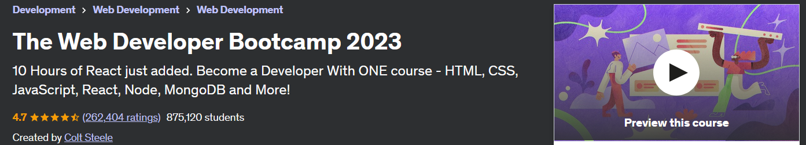

## The Web Developer Bootcamp 2022



Boosting my knowledge to up to speed. This contains exercise files and my own notes alongside with them.<br/>
Mini projects which are worth of showing are bolded in `The Major Projects`.

All course material from The Web Developer Bootcamp 2022 by Colt Steele

[The Course at Udemy](https://www.udemy.com/course/the-web-developer-bootcamp/)   

Insert certificate here when completed

**Note: The material provided in this repository is only for helping those who may get stuck at any point of time in the course. It is very advised that no one should just copy the solutions(violation of Honor Code) presented here.**


## Progress
- [x] Section 01 - Course Orientation
- [X] [Section 02](https://github.com/developersCradle/web-dev-bootcamp/tree/master/Section%202) - An Introduction to Web Development
- [X] [Section 03](https://github.com/developersCradle/web-dev-bootcamp/tree/master/Section%203) - HTML: The Essentials
- [x] [Section 04](https://github.com/developersCradle/web-dev-bootcamp/tree/master/Section%204) - HTML: Next Steps & Semantics
- [x] [Section 05](https://github.com/developersCradle/web-dev-bootcamp/tree/master/Section%205) - HTML: Forms & Tables
- [x] [Section 06](https://github.com/developersCradle/web-dev-bootcamp/tree/master/Section%206) - CSS: The Very Basics
- [x] [Section 07](https://github.com/developersCradle/web-dev-bootcamp/tree/master/Section%207) - The World of CSS Selectors
- [x] [Section 08](https://github.com/developersCradle/web-dev-bootcamp/tree/master/Section%208) - The CSS Box Model
- [ ] [Section 09](https://github.com/developersCradle/web-dev-bootcamp/tree/master/Section%209) - Other Assorted Useful CSS Properties
- [ ] [Section 10](#) - Responsive CSS & Flexbox
- [ ] [Section 11](#) - Pricing Panel Project
- [ ] [Section 12](#) - CSS Frameworks: Bootstrap
- [ ] [Section 13](#) - OPTIONAL Museum Of Candy Project
- [x] [Section 14](https://github.com/developersCradle/web-dev-bootcamp/tree/master/Section%2014) - JavaScript Basics!
- [x] [Section 15](https://github.com/developersCradle/web-dev-bootcamp/tree/master/Section%2015) - JavaScript Strings and More
- [x] [Section 16](https://github.com/developersCradle/web-dev-bootcamp/tree/master/Section%2016) - JavaScript Decision Making
- [x] [Section 17](https://github.com/developersCradle/web-dev-bootcamp/tree/master/Section%2017) - JavaScript Arrays
- [x] [Section 18](https://github.com/developersCradle/web-dev-bootcamp/tree/master/Section%2018) - Section 18: JavaScript Object Literals
- [x] [Section 19](https://github.com/developersCradle/web-dev-bootcamp/tree/master/Section%2019) - Section 19: Repeating Stuff With Loops 
- [x] [Section 20](https://github.com/developersCradle/web-dev-bootcamp/tree/master/Section%2020) - Introduction Function. Tee tehtävät kun aikaa!
- [x] [Section 21](https://github.com/developersCradle/web-dev-bootcamp/tree/master/Section%2021) - Leveling Up Our Function
- [x] [Section 22](https://github.com/developersCradle/web-dev-bootcamp/tree/master/Section%2022) - Callbacks & Array Methods 
- [x] [Section 23](https://github.com/developersCradle/web-dev-bootcamp/tree/master/Section%2023) - Newer JavaScript Features
- [x] [Section 24](https://github.com/developersCradle/web-dev-bootcamp/tree/master/Section%2024) - Introducing The World Of The DOM selvitä pieni TODO
- [x] [Section 25](https://github.com/developersCradle/web-dev-bootcamp/tree/master/Section%2025) - The Missing Piece: DOM Events
- [ ] [Section 26](#) - Score Keeper CodeAlong
- [x] [Section 27](https://github.com/developersCradle/web-dev-bootcamp/tree/master/Section%2027) - Async JavaScript: Oh Boy!
- [x] [Section 28](https://github.com/developersCradle/web-dev-bootcamp/tree/master/Section%2028) - AJAX and API's
- [x] [Section 29](https://github.com/developersCradle/web-dev-bootcamp/tree/master/Section%2029) - Prototypes, Classes, & OOP
- [ ] [Section 30](#) - Mastering The Terminal
- [ ] [Section 31](#) - Our First Brush With Node
- [ ] [Section 32](#) - Exploring Modules The NPM Universe
- [ ] [Section 33](#) - Creating Servers With Express
- [ ] [Section 34](#) - Creating Dynamic HTML With Templating
- [ ] [Section 35](#) - Defining RESTful Routes
- [ ] [Section 36](#) - Our First Database: MongoDB
- [ ] [Section 37](#) - Connecting To Mongo With Mongoose
- [ ] [Section 38](#) - Putting It All Together: Mongoose With Express
- [ ] [Section 39](#) - YelpCamp: Campgrounds CRUD
- [ ] [Section 40](#) -
- [ ] [Section 41](#) -
- [ ] [Section 42](#) -
- [ ] [Section 43](#) -
- [ ] [Section 44](#) -
- [ ] [Section 45](#) -
- [ ] [Section 46](#) -
- [ ] [Section 47](#) -
- [ ] [Section 48](#) -
- [ ] [Section 49](#) -
- [ ] [Section 50](#) -
- [ ] [Section 51](#) -
- [ ] [Section 52](#) -
- [ ] [Section 53](#) -
- [ ] [Section 54](#) -
- [ ] [Section 55](#) -
- [ ] [Section 56](#) -
- [ ] [Section 57](#) -
- [ ] [Section 58](#) -
- [ ] [Section 59](#) -
- [x] [Section 60](https://github.com/developersCradle/web-dev-bootcamp/tree/master/Section%2060) - Introducing React
- [x] [Section 61](https://github.com/developersCradle/web-dev-bootcamp/tree/master/Section%2061) - JSX In Detail
- [x] [Section 62](https://github.com/developersCradle/web-dev-bootcamp/tree/master/Section%2062) - Local React Apps With Vite
- [ ] [Section 63](https://github.com/developersCradle/web-dev-bootcamp/tree/master/Section%2063) - Working With Props
- [ ] [Section 64](#) - Shopping List Demo: keys, prop types, and more!
- [ ] [Section 65](#) - React Events
- [ ] [Section 66](#) - The Basics of React State
- [ ] [Section 67](#) - Intermediate State Concept
- [ ] [Section 68](#) - Component Design
- [ ] [Section 69](#) - React Forms


- Add more when time comes, JS kohdat opiskellut nyt voi edetä angulariin, palaa kun taas aikaa
- TODO katso noi kaikki tehtävät lävitse listtaan ja katso nuo pienet typot, kun aikaa :D
- TODO katso muotoilut lävitse .md filuista, katsottu 1-7, 24,28 kappaleet

## The Major Projects/Exercise
* Section 03 Exercises
    * [1_Exercise](https://htmlpreview.github.io/?https://github.com/developersCradle/web-dev-bootcamp/blob/master/Section%203/coding_exercise_pangoli_1.html)
    * [2_Exercise](https://htmlpreview.github.io/?https://github.com/developersCradle/web-dev-bootcamp/blob/master/Section%203/coding_exercise_favorite_exercise_2.html)
* Section 5 Exercises
    * [Search Hack](https://htmlpreview.github.io/?https://github.com/developersCradle/web-dev-bootcamp/blob/master/Section%205/redditHack.html)
    * [formMarathon](https://htmlpreview.github.io/?https://github.com/developersCradle/web-dev-bootcamp/blob/master/Section%205/marathonForm.html)
* Section 7 Exercises
    * [09_Exercise](https://htmlpreview.github.io/?https://github.com/developersCradle/web-dev-bootcamp/blob/master/Section%207/coding_exercise_9.html)
    * [10_Exercise](https://htmlpreview.github.io/?https://github.com/developersCradle/web-dev-bootcamp/blob/master/Section%207/coding_exercise_10.html)
    * [11_Exercise](https://htmlpreview.github.io/?https://github.com/developersCradle/web-dev-bootcamp/blob/master/Section%207/Coding_Exercise_11.html)

* Section 24 Exercises
    * [PokemonDemo](https://htmlpreview.github.io/?https://github.com/developersCradle/web-dev-bootcamp/blob/master/Section%2024/pokemon.html)
* Section 25 Exercises
    * [59_Exercise](https://htmlpreview.github.io/?https://github.com/developersCradle/web-dev-bootcamp/blob/master/Section%2025/coding_exercise_59.html)
    * [60_Exercise](https://htmlpreview.github.io/?https://github.com/developersCradle/web-dev-bootcamp/blob/master/Section%2025/coding_exercise_60.html) 
    * [Random Color](https://htmlpreview.github.io/?https://github.com/developersCradle/web-dev-bootcamp/blob/master/Section%2025/randomColor.html) **<- Random Color game**
* Section 28 Exercises
    * [TVSearchApp](https://htmlpreview.github.io/?https://github.com/developersCradle/web-dev-bootcamp/blob/master/Section%2028/tvSearch.html)  **<- TV Show Search App**
* Section 61 Exercises
    * [RandomPokemonCard](https://codesandbox.io/s/thirsty-allen-9yzhc4?file=/src/RandomPokemon.js)  **<- Random Pokemon card**
    

- Todo jäin 18kpl katso formatointi ja typot
- Todo kts tehtävät ja lisäää    
- Todo muuta tehtävien nimetydehnmukaiseksi ja katso nuoli ja boldaus
- Todo joku css liittyvä projekti ja linkkaa tänne, niin saa ajattua opit loppuun asti


FROM OLD COURSE FROM HERE ONE, rawgit got deprecated, some links migrated to HTML preview and work


## The Major Projects
* Section 03 Exercises
    * [1_Exercise](https://rawgit.com/developersCradle/MyProjects/master/WebDevBootcamp/Web%20Developer%20Bootcamp/03%20Introduction%20to%20HTML/1_Exercise.html)
    * [2_Exercise](https://rawgit.com/developersCradle/MyProjects/master/WebDevBootcamp/Web%20Developer%20Bootcamp/03%20Introduction%20to%20HTML/2_Exercise.html)
    
* Section 04 Exercises
    * [1_Exercise](https://cdn.rawgit.com/developersCradle/MyProjects/6f1162c0/WebDevBootcamp/Web%20Developer%20Bootcamp/04%20Intermediate%20HTML/Exercise_1.html)
    * [2_Exercise](https://cdn.rawgit.com/developersCradle/MyProjects/6f1162c0/WebDevBootcamp/Web%20Developer%20Bootcamp/04%20Intermediate%20HTML/Exercise_2.html)

* Section 05 Exercises
    * [1_Exercise](https://cdn.rawgit.com/developersCradle/MyProjects/c03b65ca/WebDevBootcamp/Web%20Developer%20Bootcamp/05%20Introduction%20to%20CSS/selectorsExercise.html)

* Section 06 Exercises
    * [1_Exercise](https://cdn.rawgit.com/developersCradle/MyProjects/a7c4e76a/WebDevBootcamp/Web%20Developer%20Bootcamp/06%20Intermediate%20CSS/board.html)
    * [2_Exercise](https://htmlpreview.github.io/?https://github.com/developersCradle/web-dev-bootcamp/blob/master/Archive/06%20Intermediate%20CSS/photoGrid.html) **<-- Small Gallery** (todo add oppening of image)
    * [3_Exercise](https://htmlpreview.github.io/?https://github.com/developersCradle/web-dev-bootcamp/blob/master/Archive/06%20Intermediate%20CSS/blog.html) **<-- Simple blog**

* Section 07 Exercises
	* [1_Exercise](https://htmlpreview.github.io/?https://github.com/developersCradle/web-dev-bootcamp/blob/master/Archive/07%20Bootstrap/gallery.html) **<-- Image gallery using Bootsrap**
	* [2_Exercise](https://htmlpreview.github.io/?https://github.com/developersCradle/web-dev-bootcamp/blob/master/Archive/07%20Bootstrap/index.html) **<-- Startup page with Bootstrap**


* Section 08 Exercises
    * [1_Exercise](https://rawgit.com/developersCradle/MyProjects/master/WebDevBootcamp/Web%20Developer%20Bootcamp/08%20Introduction%20to%20JavaScript/stalker.html)
    * [2_Exercise](https://rawgit.com/developersCradle/MyProjects/master/WebDevBootcamp/Web%20Developer%20Bootcamp/08%20Introduction%20to%20JavaScript/calc.html)

* Section 09 Exercises
    * [1_Exercise](#)


    
## Files
*   [Slides](https://webdev.slides.com/coltsteele/)


Kaiken tämän jälkeen tee github pages

IS needed?

MYSTERY TO BE SOLVED
https://github.com/developersCradle/web-dev-bootcamp/commit/5e1f81b3bc7fde34061b5d66347bba4ac64333f7
```
const person = {
    firstName: 'Viggo',
    lastName: 'Mortensen',
    fullName: function () {
        return `${this.firstName} ${this.lastName}`
    },
    shoutName: function () {
        setTimeout(() => {
            //keyword 'this' in arrow functions refers to the value of 'this' when the function is created
            console.log(this);
            console.log(this.fullName())
        }, 3000)
    }
} 
```