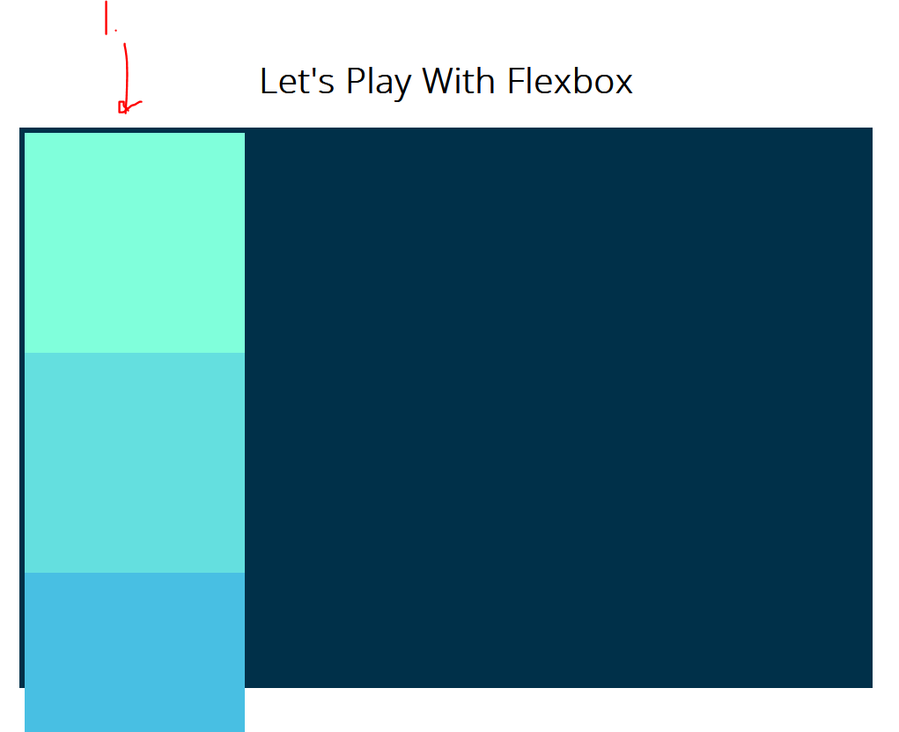
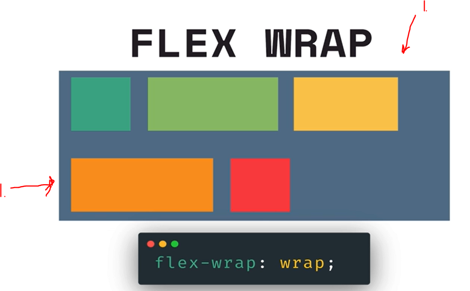

# Section 10: Responsive CSS & Flexbox

Section 10: Responsive CSS & Flexbox

# What I Learned

1. **Flexbox** is relative new in web development

- Flexbox answers how elements are distributed evenly and when space is getting smaller, how these elements are manged in such situations.
    - These are "flexible"

### First property - Display

- Turning flexbox on: `display: flex;`

1. Flexbox before, before turning on

1. After turned on

1. When turning display into flex there will be two **AXIS**
    - The **Main axis** is the important one.

- Is property is `flex-direction: row`
    - Meaning element goes from left to right, hence `row`. Is default for felxbox`row`

1. `row-reverse` makes our flex direction goes from right to left.

- Two other one makes elements go from up to down

### Second property - Justify Content

- Tells how content is distributed across main **axis**

1. `flex-start` defaults to where flex direction was settled. This is default behavior. In this context, this will populate flexbox to its main **AXIS** and where population will start. This is decided by `justify-content`(in this case from left to right).

- `justify-content:center` content is centered around main axis can change
- [Justify Content](https://developer.mozilla.org/en-US/docs/Web/CSS/justify-content). Other many other properties for aligning content

### Third property - Flex Wrap

- Determine if new elements are going to wrap to new line or new column

1. New elements won't be putted into first line. They are "flex wrapped" to next line if there is no room

- Wrapping tells direction for **cross-axis**

### Fourth property - Align Items

- Distribute our items and space along **cross axis**

- Todo jäin tähän

