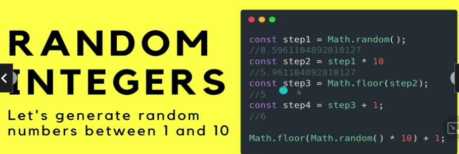

# Section 15: JavaScript Strings and More

JavaScript Strings and More

# What I Learned

* String "String"
	* "Srign" or 'Sring', not "String'
* Strings are indexed
* `let city = 'Tokyo';` `city[0]; -> 'T'`
	* city[121212] will result to `undefined`
		* JavaScript way to tell `nothing there`
* Strings have a length, one of magical property
	* `city.length;` → 5
* `"lol" + " lol2"` → concatenation → "lol lol2"
* JavaScript String is immutable
* `" omg  ".trim();` → "OMG", cuts out white spaces
* `"pancake".slice(0, 3);` //"pan" - slice from index 0 up to index 3
* [Slice](https://developer.mozilla.org/en-US/docs/Web/JavaScript/Reference/Global_Objects/String/slice)
* `"pancake".slice(-3);` → "ake" using minus works from end
* `replace` - Returns a new string, with the FIRST match replaced
	* "pump".replace("p", "b"); //"bump" - "only" replaces first "p"
* "lol".repeat(2) → "lollol"
* Before String `Template Literals` you had to use such way to make up strings
	* `"You bought " + qty + " " + product + ". Total is: " + price + qty;`
		* `output` → "You bought 5 Artichoke. Total is: 11.25"
* Template Literals are strings that allow embedded expressions. Evaluated and turned into string
	* `I am ${ 10 + 2 } years old` -> "I am 22 old"
	* Need to use **back-tick characters** **``**
* With Template Literate `You bought ${qty} ${product}. Total is: $${price * qty}`;
	* `output` → "You bought 5 Artichoke. Total is: $11.25"
* `Null` needs to be **assigned**, does not point to anywhere
	* `let logInUser = null;` → null
* `Undefined`, variables which are **not assigned** values
	* `let x;` → `undefined`
* Object is collection of methods and variables
	* Math.PI

