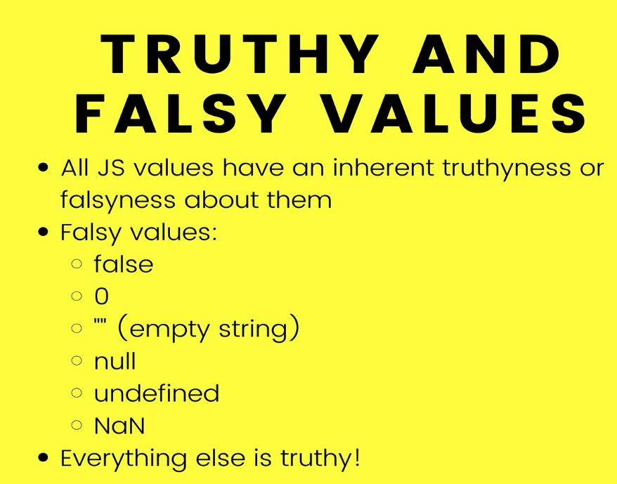

# Section 16: JavaScript Decision Making

JavaScript Decision Making

# What I Learned
- [Unicode](https://www.unicode.org/charts/PDF/U0000.pdf)
- Comparisons chracters are using unicode values
- `==` value comparisons
- `1 == '1'` first conversion is made after that comparison is made 
- `===` strict equal, does not make conversions
	- Always use `===` if need equality

