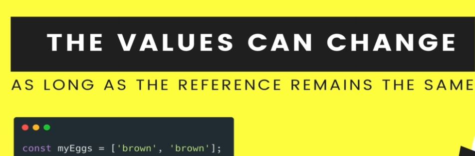
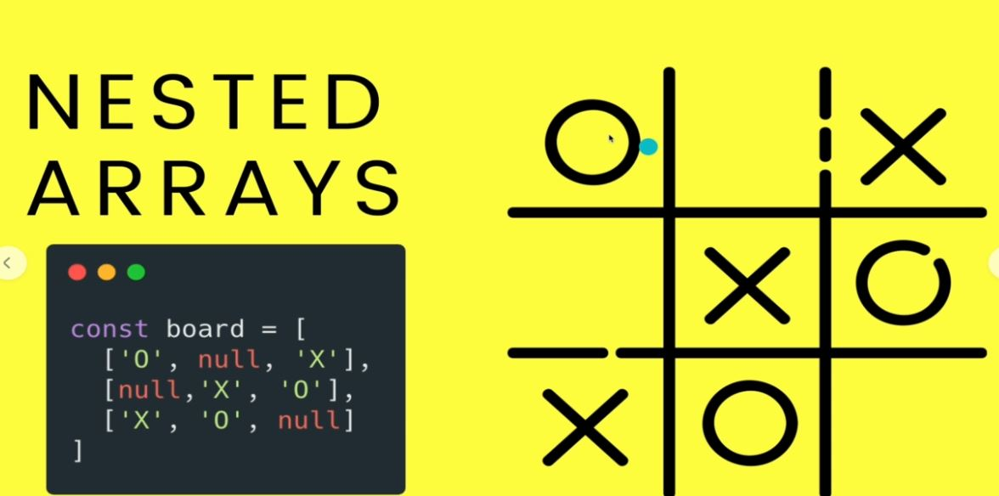

# Section 17:  JavaScript Arrays
JavaScript Arrays

# What I Learned

- Creating array
- `let students = [];`
- Arryays can have many types
- Most array methods
- 
- More common methdos
- 
- `?` in methods signature express optionlity
- 
- `.sort()` not always sort as intended
    -`let luckyNums = [1,2323,23]`
        - Reference is stored to luckyNums, which points to these numbers 
    -`[1,2,3] === [1,2,3]`  -> False
        - Contents are the same, but reference in memory is different
- 
- As long reference does not change, there will not be errors
    -  myEggs = `["test", "test2"];` 
        - Error, new reference is assigned to myEggs
- Arrays should be use with `const` to be safe
- Nested rows
- 