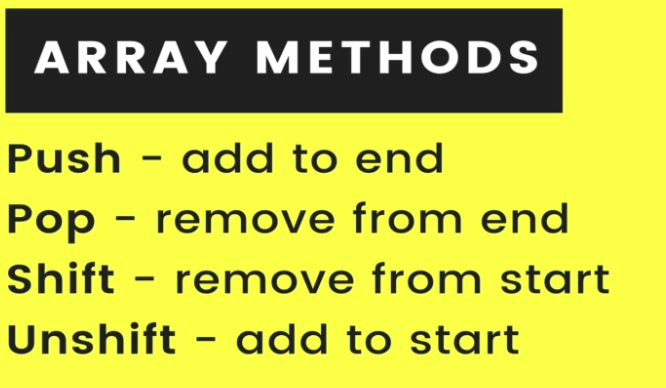
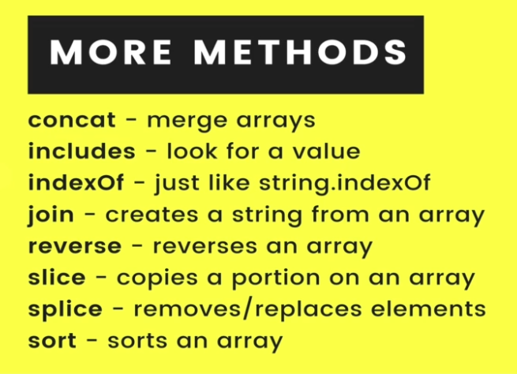
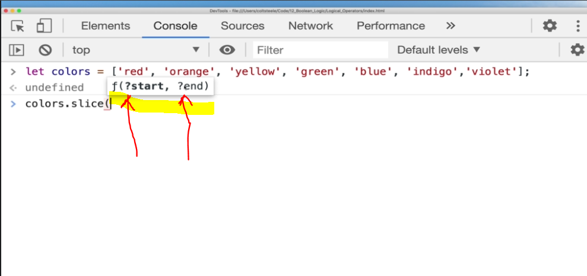

# Section 17:  JavaScript Arrays
JavaScript Arrays

# What I Learned

- Creating array
- `let students = [];`
- Arryays can have many types
- Most array methods
- 
- More common methdos
- 
- `?` in methods signature express optionlity
- 
- `.sort()` not always sort as intended