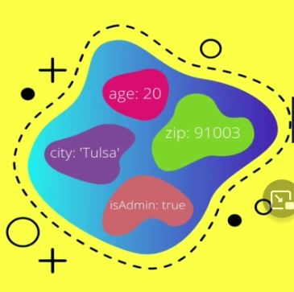
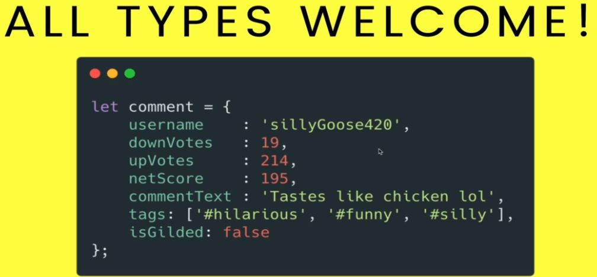
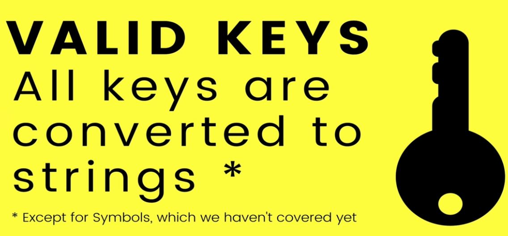
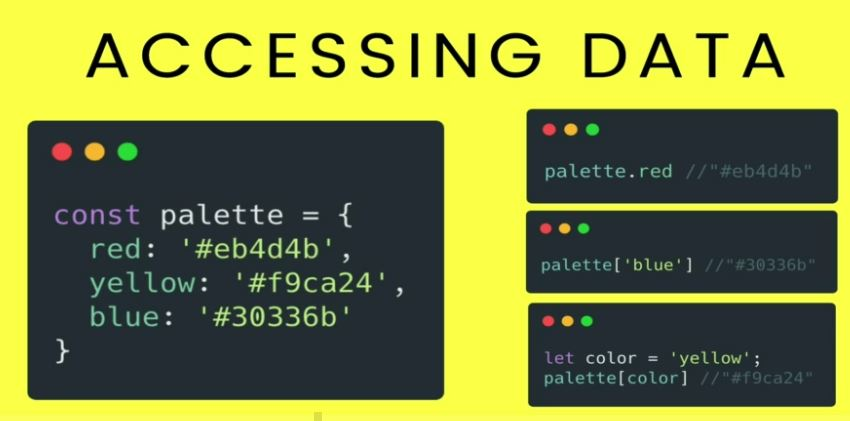
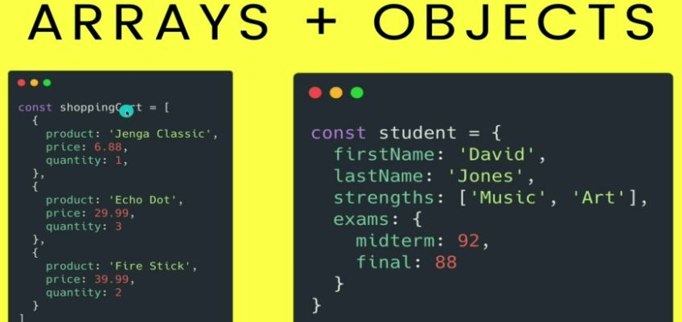

# Section 18: JavaScript Object Literals

JavaScript Object Literals

# What i learned
- JS object are collection of `properties`
    - Properties are key-value pair
    - Rather accessing using indexes, like in arrays, we use custom keys
    

```
const someObjectData = {
        data1 : 12,
        data2 : "someText",
        data3 : true
    };
```

- Saving in object helps structurally keep data trackable
    - Which one is best
        - `numberOfSteps : 200` OR [200]
        - Key value pairs helps keep track of structure 
- Object literal, key value pairs
    - Object are also arrow types, stores references like arrays
    - Not order in object literal types, like in array



- Accessing date out from Object literal
    - comment["username"]
        - This can be used if username is variable, evaluated in when run `comment[username]`
    - comment.username



- Every key is converted to string behind schenes



- Three main ways accessing information in JS Objects
    - These can be also add and modify
    - Example. `palette.blue = "#2222";`
    - Adds new property to palette Js Object 
- Its common to mix and match arrays and objects together
