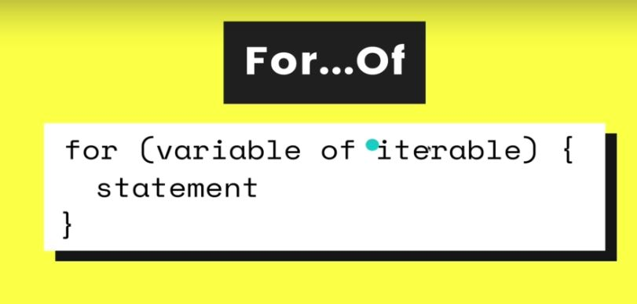

# Section 19:  Repeating Stuff With Loops
Repeating Stuff With Loops

# What I Learned

- `for of loop`
    - Loop over arrays or other individual objects
- 
    - variable is indivudaul element in my arrays, of `iterable object`
    - if don't need index forOf loop is good option
    - iterable object, "string" are also `iterable objects`
    - forOf does not work with object literal
        - Need to you for in
        - Or Object.values(values), turn values to array