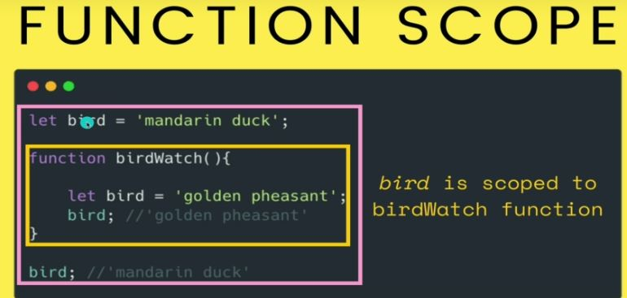
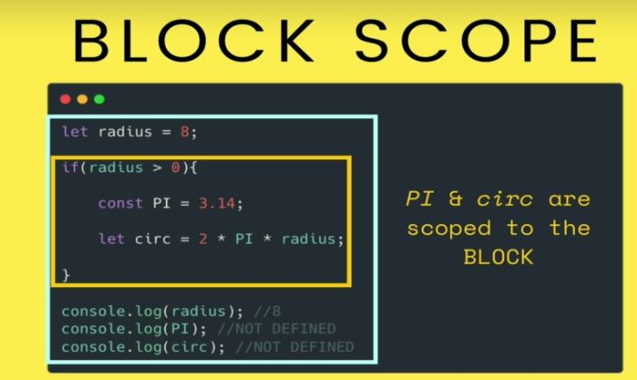
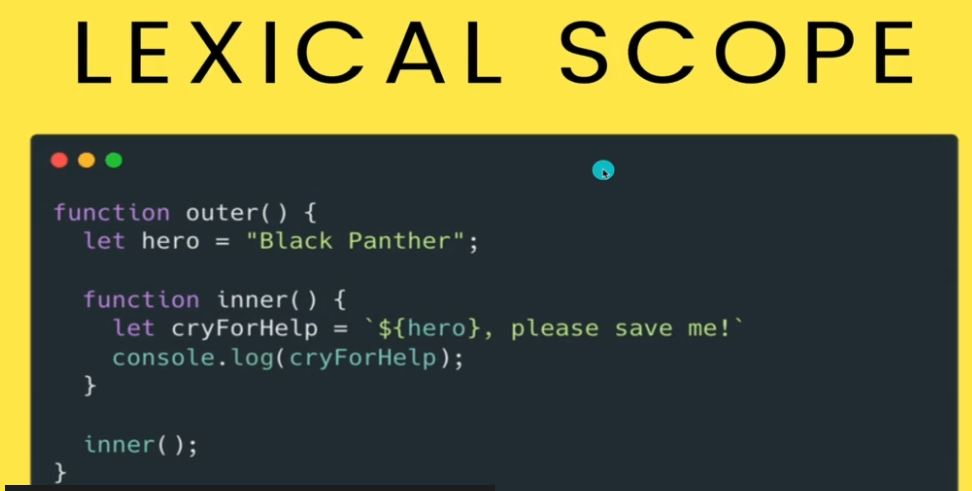
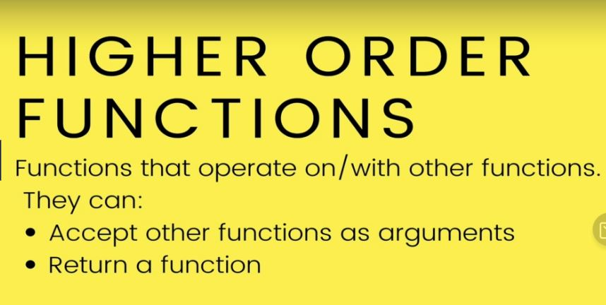
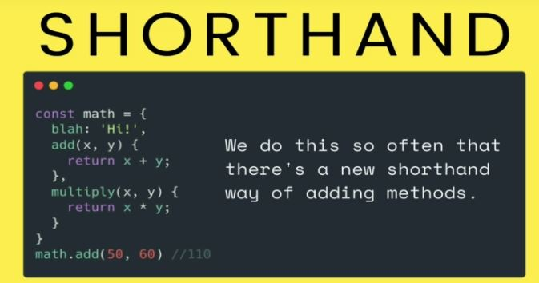
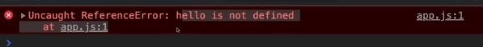

# Section 20:  Introduction Function
 Introduction Function

# What I Learned
- You should always define function before you use them
    - Before you get used to hoisting
- `fuction greet(first, last)`
    - `greet(1,2)` or `greet(2,1)`
        - Order matters
- To get first letter from lastName `lastName[0]`
- Function scope
    - Old way of declaring variable is using `var`
        - They are scoped to functions, but not to blocks
        - Let and const were introduced for this problematic reason of scopes
        - dont use `var`
    - 
- `{  }` block scope
    - 
- Lexical scope, inner has access to outher methods variables
    - 
- Function expression
    - Stores function inside variable
    - `const add = function (x,y) {
        return x + y;
    }`
    - Called by name of variable, not name of function
    - Function are values in Js 
- Higher Order Function
    - 
    - Accepts functionas argument `function callTwice(func)
    {
        func();
        func();
    }`
- Return function
    - We can return function and save it `const isAdult = makeBetweenFunc(19,64);`
- Factory function which makes function
    - `function makeBetweenFunc(min, max) {
    return function (num) {
        return num >= min && num <= max;
        }
    }`
- adding properties and methods
    - `const myMath = {
        PI : 3.14159,
        square : function (num) {
            return num * num;
        },
        cube : function (num) {
            return num ** 3;
        }
    }`
    - More newer way to define methods inside object or class
        - 
    - In js value of `this` depends on invocation context where is used in
    - window is huge object where things are defined, top level object in Js
    - this refers how it was called
        - What were left of `.` operator
    - Errors in JS, Try/Catch
          - 
          - We could Catch such errors