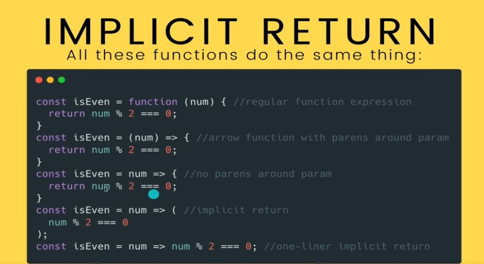

# Section 22: Callbacks & Array Methods 

Focus here, passing functions in

# What I Learned
- Foreach more popular before forOf were introduced
- 
``` numbers.forEach(function (el) {
        console.log(el)
})
```
    - Passing anynomoyus function
        -el will be each elements one at the time
    - Only need once, no need define else where
    - Older way 
- `for (let el of numbers) {
     console.log(el);
 }`
    - This was newer way loopping trought array
- Map, maps array one state to another
- 
    - Map is usually used when we want some **portion** of data OR when need **transform** data array to some other data array 
- 
    - Arrow functions are to make function expressions
```
    const add = (x,y) => {
        return x + y;
}
```
- If only one argument parenthesis are optional
```
    const square = num => {
        return num * num;
}
```
- Implicit returns only works with arrow function
- 
    - Implicit returns only works if there only one line
- `setTimeout` method/function after some time, callback is called 
```
setTimeout(() => {
    console.log("Hello");
}, 3000); 
```
- `setInterval` calls, callback after time to time
```
const id = setInterval(() => {
    console.log(Math.random());
},2000);
```
    - stops interval `clearIterval(id)`
- 