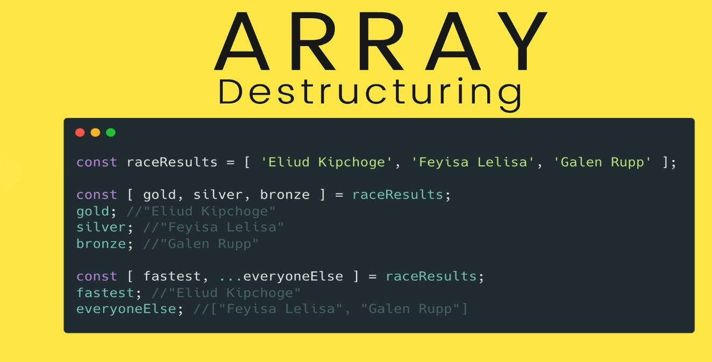

# Section 23: Newer JavaScript Features
JavaScript Object Literals

# What i learned
- 
- Older way defining default param
- 
- Newer way is define is method param signature
    - Note that default params needs come **AFTER** normal ones. Example ``person`` needs to be first in method signature
```
function greet(person, msg = "Hey there", punc = '!') {
    console.log(`${msg}, ${person}${punc}`)
}
```
- SPREAD, expanding something
    - Inside function calls its opens up the list of `the thing` into list of arguments
- 
```
const nums = [13, 4, 5, 21, 3, 3, 1, 2, 7, 6, 4, 2, 53456];

// SPREAD IN FUNCTIONS
Math.max(nums) //NaN
Math.max(...nums) //53456

```
- Using spread with Array Literals
```
// SPREAD IN ARRAYS
const cats = ['Blue', 'Scout', 'Rocket'];
const dogs = ['Rusty', 'Wyatt'];

const allPets = [...cats, "remu" , ...dogs];//
['Blue', 'Scout', 'Rocket', 'remu', 'Rusty', 'Wyatt']
```
- Note `"remu"` was added by hand 
- Common way to make direct copy 
    - `const copy = [...cats];`
- 
- 
- Idea is copy object literal to another object literal, take key value pairs and copy them to another one
```
// SPREAD IN OBJECTS
const feline = { legs: 4, family: 'Felidae' };
const canine = { isFurry: true, family: 'Caninae' };

const catDog = { ...feline, ...canine };
```
- Family key is overridden to "Caninae"
- Why spreading objects
    - When creating copy of an object
        - Used a lot in libraries and tool like react
```
const dataFromForm = {
    email: 'blueman@gmail.com',
    password: 'tobias123!',
    username: 'tfunke'
}
const newUser = { ...dataFromForm, id: 2345, isAdmin: false }
```
- Illustrating point, user provides data form, you want to add some own data to it hence `id: 2345, isAdmin: false` are added 

- 

- Every method/function has argumens object passed into it
    - You can see it 
    ```
    function sum(){
        console.log(arguments);
    }
    ```
- Note that arguments does not work with arrow function, one reason to use `...` **REST** parameters
- 
- **REST**, collect rest of values
    - In action, like `varargs` in Java programming language
- 
```
function raceResults(gold, silver, ...everyoneElse) {
    console.log(`GOLD MEDAL GOES TO: ${gold}`)
    console.log(`SILVER MEDAL GOES TO: ${silver}`)
    console.log(`AND THANKS TO EVERYONE ELSE: ${everyoneElse}`)
}
```
- 
- Singling out elements from array `Destructing`
    - **Array Destructing**
- Based on position

    - **Object Destructing**
    - Order does not matter here, name does
```
const user = {
    email: 'harvey@gmail.com',
    password: 'sCoTt1948sMiTh',
    firstName: 'Harvey',
    lastName: 'Milk',
    born: 1930,
    died: 1978,
    bio: 'Harvey Bernard Milk was an American politician and the first openly gay elected official in the history of California, where he was elected to the San Francisco Board of Supervisors',
    city: 'San Francisco',
    state: 'California'
}


const firstName = user.firstName;
const lastName = user.lastName;
// If many values here, with same pattern as above
```
`const { firstName, lastName } = user;`
- Order does not matter 
- There two are equalent
- Same, but with renaming the name, `born` property is saved as `birthYear`
    - `const { born: birthYear } = user;`
    - Also works with default value
    - `const { died: deathYear = 'N/A' } = user;`
- 
- We can `destruct` value when passing in **Param Destructing** 
```
function fullName({ firstName, lastName }) {
    return `${firstName} ${lastName}`
}

```
- No need for whole object, just `firstname` and `lastname`
    - Popular
- Common usage, we are only caring about only one propety in this case `score`. **Param Destruct** on way in to filter array method 
    - `movies.filter((movie) => movie.score >= 90)`
    - **TO**
    -  `movies.filter(({ score }) => score >= 90)`