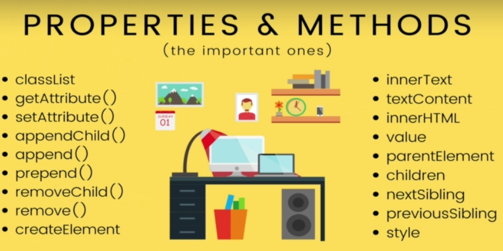
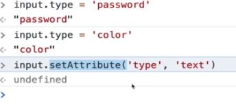
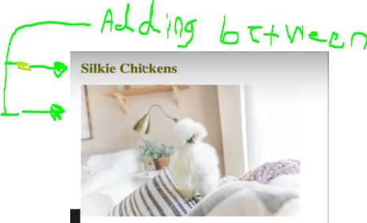

# Section 24: Introducing The World Of The DOM

Introducing The World Of The DOM

# What I Learned
- DOM is JS way of looking webpage
    - Bunch of objects which you can acces via JS


- Js object has relationships
- Everything is stored inside of **document object**
- `Document` is most parent
    - Object like `window`
- To see this in console 
    - `console.dir(document);`


- Created automatically by browser based on content of page


- Dom has many ways to manipulate site
- `Element` is the most general base class from which all element objects (i.e. objects that represent elements) in a Document inherit
- Selection methods from DOM
    - These three main one **old ways** of selecting
    - **getElemetById**
        - Exist on `document`
        - `document.getElementById('banner');`
        - DOM Object is returned, not html


- **getElementsByTagName** and **getElementsByClassName**
    - **Selects more than one**
        - returns `HTMLcollection`
            - Looks like array, **not array**
            - Array methods does not work, example `.map()` won't work
            - Iterable collection


- Iterable collection, we still can loop trough it

```
const allImages = document.getElementsByTagName('img');

for (let img of allImages) {
    console.log(img);
}
```


- More newer way manipulating DOM
    - Many tools in one
        - Selecting by:
        - **Returns first found match**
            - Class `document.querySelector('.square');`
            - Id `document.querySelector('.square');`
            - Element `document.querySelector('h1');`
- Selecting type `<a> `and with atrribute `Java`


- `querySelectorAll` same as above, byt returns many matches
- One usage of `querySelectorAll`, with descendant selector  from CSS

```
const links = document.querySelectorAll('p a');//Select paragraph which have anchor tags

for (let link of links) {
    console.log(link.href)
}
```

- Dom object manipulation propertyes/methods. **Most important ones**



- `Inner text` is text between opening and closing tag
- `document.querySelector('p').innerText`
    - Gets text inside `<p>this text will be selected</p>`
- `textContent` almost like same as `innerText` with some differences
- `textContent` gives uss everything as text contained in given element
- Example using **textContent**

```

<p>
    This is an awesome paragraph
</p>

//Select the <p> tag:
var tag = document.querySelector("p");

//Retrieve the textContent:
tag.textContent // "This is an awesome paragraph"

//alter the textContent:
tag.textContent = "blah blah blah";

```


- `innerHTML` gives uss html content, we could add `document.querySelector('p').innerText = '<b>This is bold</b>'`. Will be treated as HTML and would be shown as bold
- `id="banner"` and `class="toctitle"` are attributes
- manipulating attribute
    - `document.querySelector('#banner').id = 'newId';
- We can also access atrribute throught `getAttribute()`
- Setting attributes can be done using **`getAttribute()`** and reading **`setAttribute()`**

- Example usinng **setAttribute()** or **getAttribute()**

```

<a href="www.google.com">I am a link </a>


var link = document.querySelector("a");
link.getAttribute("href"); //"www.google.com"

// CHANGE HREF ATTRIBUTE

link.setAttribute("href", "www.gods.com");
//<a href="www.gods.com"> I am a link </a>

//TO CHANGE THE IMG SRC
var img = document.querySelector("img");
img.setAttribute("src", "corgi.png");
//

```



- (manipulating style trought JS) Selecting and manipulating DOM element style can be tricky. `h1.style` not the same as applied `css style`
    - Apply css style, wont be shown in DOM element
- Example of manipulating style trought DOM element
    -`h1.style.fontSize = '3m';`
    - Assigned values needs to be **strings**
- Changes all links to diffrent color trought js `style` 

```
for (let link of allLinks) {
    link.style.color = 'rgb(0, 108, 134)';
}
```

- Need to wait when browser loads and call window object to figure out apllied css
    - `window.getCoputedStyle(h1)` gets computed style for element
        - `h1` is element object in the DOM
    - get computed style `window.getCoputedStyle(h1).margin`; // "21.44px 0px"
- Setting class attribute(works with one class at the time)`h2.setAttrivute('class', 'purple');`
    - Or clumsy way to add would be `h2.setAtrribute('class', '${currentClasses}' purple);`
- **classList**
    - Easy way to get current classes on element
    - Manipulate them
- Better way is using `classList` object, `h2.classList.add('purple');`
- `h2.classList.toggle('purple');` Toggling is common way using classList

- Example using 'classList'

```
/*

DEFINE A CLASS IN CSS 

.another-class {
    color: purple;
    fontSize: 76px;
}

*/


var tag = document.querySelector("h1");

//ADD A CLASS TO THE SELECTED ELEMENT
tag.classList.add("another-class");

//REMOVE A CLASS
tag.classList.remove("another-class");

//TOGGLE A CLASS
tag.classList.toggle("another-class");


```

- Its more practical to use CSS to make chages/behaviour changes 
to certain HMTL element than in pure vanilla Js. Just toggle those css classes when needed on/off
- h2.nextSibling & previousSibling
    - Gives **Node** different that DOM element
        - Nodes can represent text
        - Some browser creates linebreak nodes
        - Use `nextElemetnSibling` or `previousSibling` instead
- Creating Element

```
const ele = document.createElement('h3');
ele.innerText = 'I am new!'
document.body.appendChild(ele); // Adding to webpage
```

- Creating Element other way

```
const p = document.querySelector('p');
p.append("New added text", "Next text apended"); // Adding to last child
p.preapend(newB); //Adding to first child
```



- We want add between elements. `preapend` & `append` does not work

```

const h2 = document.createElement('h2');//creating element
h2.append("Are adorable chickens");//Adding text to h2

//We wana add after the h1
const h1 = document.querySelector('h1');
h1.insertAdjacentElement('afterend', h2); // Adding

```

- `removeChild()` older version of remove

```
const firstLi = document.querySelector('li');
const ul = firstLi.parentElement;
ul.removeChild(firstLi);
```
- Newer way `remove()`, should use this

```
const img = document.querySelector('img');
img.remove();

```

- `div inline block` why??? TODO heikkiselvitä