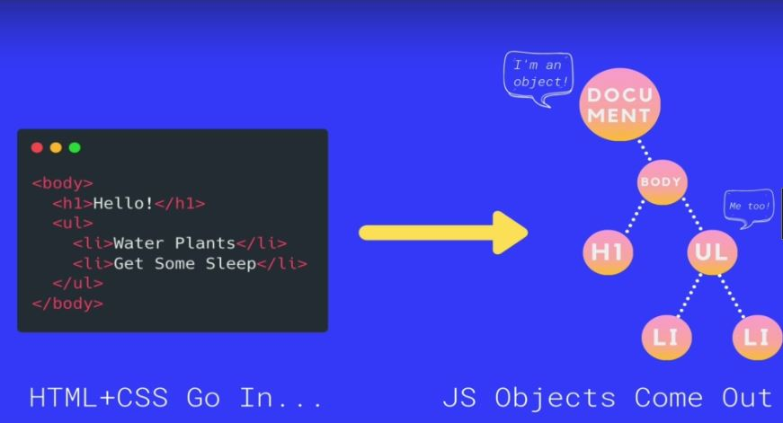
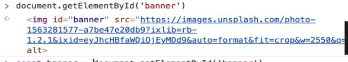
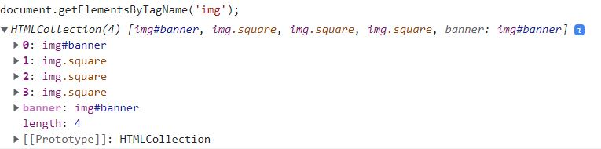
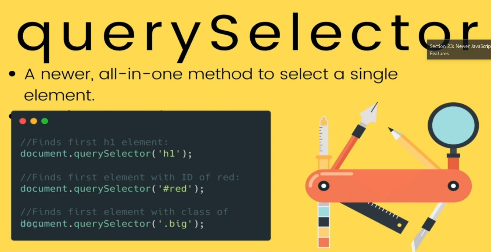
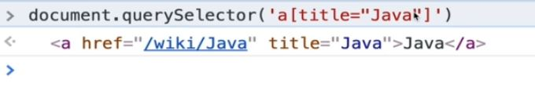

# Section 24: Introducing The World Of The DOM

Introducing The World Of The DOM
# What I Learned
- DOM is JS way of looking webpage
    - Bunch of objects which you can acces via JS

- Js object has relationships
- `Document` is most parent
    - Object like `window`
- To see this in console 
    - `console.dir(document);`

    - Created automatically by browser based on content of page

- Dom has many ways to manipulate site
- `Element` is the most general base class from which all element objects (i.e. objects that represent elements) in a Document inherit
- Selection methods from DOM
    - These three main one **old ways** of selecting
    - **getElemetById**
        - Exist on `document`
        - `document.getElementById('banner');`
        - DOM Object is returned, not html

    - **getElementsByTagName** & **getElementsByClassName**
        - **Selects more than one**
        - returns `HTMLcollection`
            - Looks like array, **not array**
            - Array methods does not work, example `.map()` won't work
            - Iterable collection

- Iterable collection, we still can loop trough it
```
const allImages = document.getElementsByTagName('img');

for (let img of allImages) {
    console.log(img);
}
```


- More newer way manipulating DOM
    - Many tools in one
        - Selecting by:
        - **Returns first found match**
            - Class `document.querySelector('.square');`
            - Id `document.querySelector('.square');`
            - Element `document.querySelector('h1');`
- Selecting type `<a> `and with atrribute `Java`

- `querySelectorAll` same as above, byt returns many matches
- One usage of `querySelectorAll`, with descendant selector  from CSS
```
const links = document.querySelectorAll('p a');//Select paragraph which have anchor tags

for (let link of links) {
    console.log(link.href)
}
```