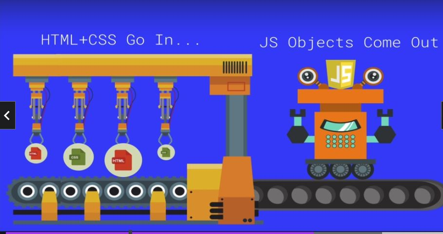

# Section 24: Introducing The World Of The DOM

Introducing The World Of The DOM
# What I Learned
- DOM is JS way of looking webpage
    - Bunch of objects which you can acces via JS

- Js object has relationships
- `Document` is most parent
    - Object like `window`
- To see this in console 
    - `console.dir(document);`

    - Created automatically by browser based on content of page

- Dom has many ways to manipulate site
 - Selection methods from DOM
    - **getElemetById**
        - Exist on `document`
        - `document.getElementById('banner');`
        - DOM Object is returned, not html

    - getElementsByTagName
    - getElementsByClassName
