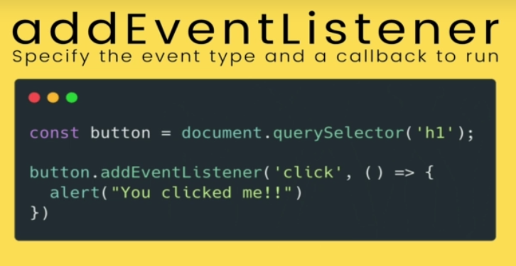
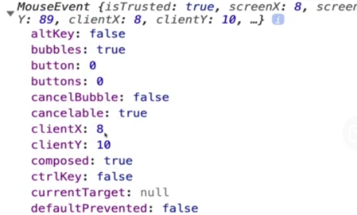

# Section 25: The Missing Piece: DOM Events
 
 The Missing Piece: DOM Events

# What I Learned

- Different types of events
- **Three** main ways to add event
    - Adding Js code direnct to HTML element
        - Inline Event Handlers
        - Not preferred
        ```
        <button onclick="alert('you clicked me!'); alert('stop clicking')">Click Me!</button>
        ```
        - Hard to code many lines
        - Hard to but same behaviour to another button, need to copy same code
        - Set function in DOM element
- We can use js to set `onClick` proporty
- **Two**Setting inside JS
```
const btn = document.querySelector('#v2');

btn.onclick = function () {
     console.log("I HOPE IT WORKED!!");
}
```

- We assigning function not executing

```
function scream() {
    console.log("AAAH!");
}

btn.onmouseenter = scream;

```
- Set function in DOM element
- We can put event is other DOM element, example <h1>
- We cannot have two callback functions for same event, we should use add event listener
- **One** Adding event listener, best one!

- 1 param, what we want to listen, callback what we wana execute
```
const btn3 = document.querySelector('#v3');
btn3.addEventListener('click', function () {
    alert("CLICKED!");
})
```
- We can add many functions with event listeners
```
tasButton.addEventListener('click', twist)
tasButton.addEventListener('click', shout)
```
- Event object is passed in even if its not in parameter signature, `evt` was not made by user
```
document.querySelector('button').addEventListener('click', function (evt) {
    console.log(evt)
})

```
- Event object `evt`

```
console.log(e.key); // could be different depending on keybord layout
console.log(e.code); // code will be same regardless of keyboard layout
```
- `e.key` key pressed
- `e.code` mapping code which were pressed 
```
<form action="/dogs">
        <input type="text" name="tweet" placeholder="tweet">
        <button>Post Tweet</button>
</form>
```
- Request is made to whatever is spesified to `action` and went to location
```
tweetForm.addEventListener('submit', function (e) {
    e.preventDefault();
```
- ´submit´ listens submit
- `e.preventDefault();` prevents default behaviour firing, `<form action="/dogs"`> case, page would not be redirected to certain address
    - we could use it inside eventListener or form posting


