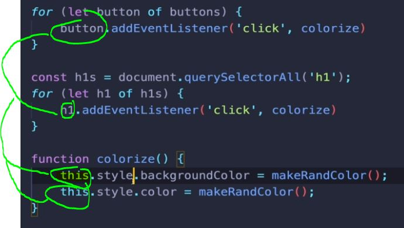

# Section 25: The Missing Piece: DOM Events
 
 The Missing Piece: DOM Events

# What I Learned

- Different types of events
- **Three** main ways to add event
    - Adding Js code direnct to HTML element
        - Inline Event Handlers
        - Not preferred
        ```
        <button onclick="alert('you clicked me!'); alert('stop clicking')">Click Me!</button>
        ```
        - Hard to code many lines
        - Hard to but same behaviour to another button, need to copy same code
        - Sets function in DOM element

- **Two** Setting inside JS
- We can use js to set `onClick` property
    ```
    const btn = document.querySelector('#v2');
    btn.onclick = function () {
        console.log("I HOPE IT WORKED!!");
    }
    ```

    - We assigning function not executing!

    ```
    function scream() {
        console.log("AAAH!");
    }

    btn.onmouseenter = scream;

    ```
    - Sets function in DOM element
    - We can put event is other DOM element, example <h1>
    - We cannot have two callback functions for same event, we should use add event listener
- **One** Adding event listener, best one!
    
    - 1nd param, what we want to listen, 2nd callback what we want to  execute
    ```
    const btn3 = document.querySelector('#v3');
    btn3.addEventListener('click', function () {
        alert("CLICKED!");
    })
    ```
    - We can add many functions with event listeners
    ```
    tasButton.addEventListener('click', twist)
    tasButton.addEventListener('click', shout)
    ```
- Random Color Game
```
const button = document.querySelector('button');
const h1 = document.querySelector('h1');

button.addEventListener('click', function () {
    const newColor = makeRandColor();
    document.body.style.backgroundColor = newColor;
    h1.innerText = newColor;
})

const makeRandColor = () => {
    const r = Math.floor(Math.random() * 255);
    const g = Math.floor(Math.random() * 255);
    const b = Math.floor(Math.random() * 255);
    return `rgb(${r}, ${g}, ${b})`;
}
```
- We can generalize method and make it call `this`, which refers in this case who called it

