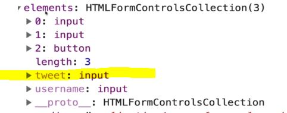

# Section 25: The Missing Piece: DOM Events
 
 The Missing Piece: DOM Events

# What I Learned

- Different types of events
- **Three** main ways to add event
    - Adding Js code direnct to HTML element
        - Inline Event Handlers
        - Not preferred
        ```
        <button onclick="alert('you clicked me!'); alert('stop clicking')">Click Me!</button>
        ```
        - Hard to code many lines
        - Hard to but same behaviour to another button, need to copy same code
        - Sets function in DOM element

- **Two** Setting inside JS
- We can use js to set `onClick` property
    ```
    const btn = document.querySelector('#v2');
    btn.onclick = function () {
        console.log("I HOPE IT WORKED!!");
    }
    ```

    - We assigning function not executing!

    ```
    function scream() {
        console.log("AAAH!");
    }

    btn.onmouseenter = scream;

    ```
    - Sets function in DOM element
    - We can put event is other DOM element, example <h1>
    - We cannot have two callback functions for same event, we should use add event listener
- **One** Adding event listener, best one!
    
    - 1nd param, what we want to listen, 2nd callback what we want to  execute
    ```
    const btn3 = document.querySelector('#v3');
    btn3.addEventListener('click', function () {
        alert("CLICKED!");
    })
    ```
    - We can add many functions with event listeners
    ```
    tasButton.addEventListener('click', twist)
    tasButton.addEventListener('click', shout)
    ```
- Random Color Game
```
const button = document.querySelector('button');
const h1 = document.querySelector('h1');

button.addEventListener('click', function () {
    const newColor = makeRandColor();
    document.body.style.backgroundColor = newColor;
    h1.innerText = newColor;
})

const makeRandColor = () => {
    const r = Math.floor(Math.random() * 255);
    const g = Math.floor(Math.random() * 255);
    const b = Math.floor(Math.random() * 255);
    return `rgb(${r}, ${g}, ${b})`;
}
```
- We can generalize method and make it call `this`, which refers in this case who called it


- We can add many functions with event listeners
```
tasButton.addEventListener('click', twist)
tasButton.addEventListener('click', shout)
```

- Event object is passed in even if its not in parameter signature, `evt` was not made by user
```
document.querySelector('button').addEventListener('click', function (evt) {
    console.log(evt)
})

```
- Event object `evt`

```
console.log(e.key); // could be different depending on keybord layout
console.log(e.code); // code will be same regardless of keyboard layout
```
- `e.key` key pressed
- `e.code` mapping code which were pressed 
```
<form action="/dogs" id="tweetForm">
        <input type="text" name="tweet" placeholder="tweet">
        <button>Post Tweet</button>
</form>
```
- Request is made to whatever is spesified to `action` and went to location
```
tweetForm.addEventListener('submit', function (e) {
    e.preventDefault();
```
- ´submit´ listens submit
- `e.preventDefault();` prevents default behaviour firing, `<form action="/dogs"`> case, page would not be redirected to certain address
    - we could use it inside eventListener or form posting
- `const tweetInput = tweetForm.elements.tweet;`
    - Inside `form` there is elemetns `proeprty` which holds elements inside form. Example our `<input type="text" name="tweet" placeholder="tweet">`. What we spesified to `name` will be saved inside `tweetForm.elements`
- 
    - Elements inside form, `console.dir(tweetForm)`
