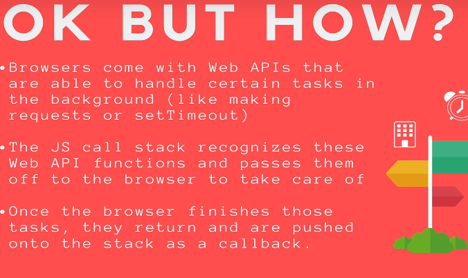
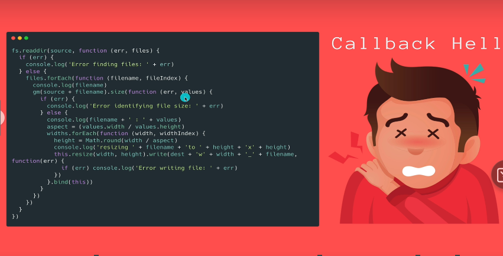
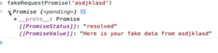

# Section 25: The Missing Piece: DOM Events
 
 The Missing Piece: DOM Events

# What I Learned

# Section 27: 

# What I Learned

- Call stack consist method what have been called
- [Call stack emultor](http://latentflip.com/loupe/?code=ZnVuY3Rpb24gbXVsdGlwbHkoeCx5KSB7CiAgICByZXR1cm4geCAqIHk7Cn0KCmZ1bmN0aW9uIHNxdWFyZSh4KSB7CiAgICByZXR1cm4gbXVsdGlwbHkoeCx4KTsKfQoKZnVuY3Rpb24gaXNSaWdodFRyaWFuZ2xlKGEsYixjKXsKICAgIHJldHVybiBzcXVhcmUoYSkgKyBzcXVhcmUoYikgPT09IHNxdWFyZShjKTsKfQoKaXNSaWdodFRyaWFuZ2xlKDMsNCw1KQ%3D%3D!!!)
- JS is **single threded**
    - Can run one codeline at the time
    - Browser does this threaading
    - Browser keeps track of time
- 
    - Browsers implements webAPI which js then calls
- [webAPIS single thread](http://latentflip.com/loupe/?code=Y29uc29sZS5sb2coIlNlbmRpbmcgcmVxdWVzdCB0byBzZXJ2ZXIhIikKc2V0VGltZW91dChmdW5jdGlvbigpIHsKICAgIGNvbnNvbGUubG9nKCJIZXJlIGlzIHlvdXIgZGF0YSBmcm9tIHRoZSBzZXJ2ZXIuLi4iKQp9LCAzMDAwKQpjb25zb2xlLmxvZygiSSBBTSBBVCBUSEUgRU5EIE9GIFRIRSBGSUxFISIp!!!)

- This pattern is common to pass in callback what to do next after previous have been finished
```
const delayedColorChange = (newColor, delay, doNext) => {
    setTimeout(() => {
        document.body.style.backgroundColor = newColor;
        doNext && doNext();
    }, delay)
}

```
- Another common is pass successful or fail callback to callbacks, this is why **promises** were made
- 
- This is common problem in JS
    - Promises tries to address this problem
- `promises` are new, not support in **IE**
    - Promise is promise something good or bad
- Callback and promise version
```
// THE CALLBACK VERSION
const fakeRequestCallback = (url, success, failure) => {
    const delay = Math.floor(Math.random() * 4500) + 500;
    setTimeout(() => {
        if (delay > 4000) {
            failure('Connection Timeout :(')
        } else {
            success(`Here is your fake data from ${url}`)
        }
    }, delay)
}
// THE PROMISE VERSION 
const fakeRequestPromise = (url) => {
    return new Promise((resolve, reject) => {
        const delay = Math.floor(Math.random() * (4500)) + 500;
        setTimeout(() => {
            if (delay > 4000) {
                reject('Connection Timeout :(')
            } else {
                resolve(`Here is your fake data from ${url}`)
            }
        }, delay)
    })
}

```

- 

- Promises does not return callback, promise object
    - Promise can have three statuses"resolved", "pending", "rejected"