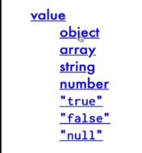
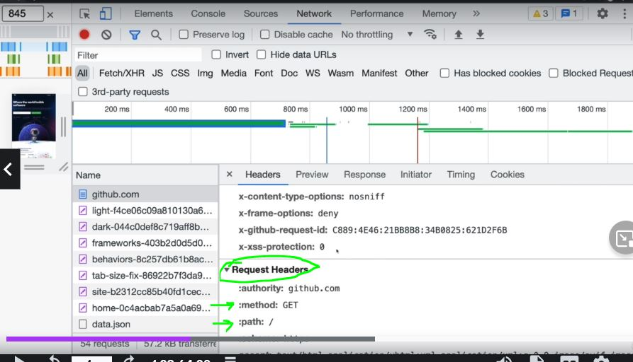
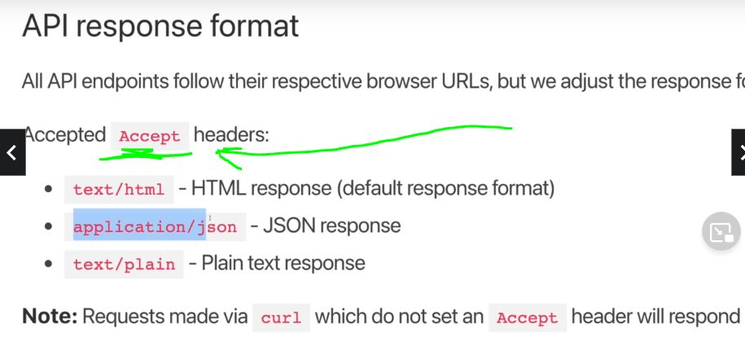

# Section 28: AJAX and API's
 
 AJAX and API's

# What I Learned
 - Making requests in Java Script, this is called **AJAX**

 

 - Ajax is making request behind scene
    - Using JS, load data, save data, or send data somewhere **behind scenes** 
        - In past you had to refresh page to send request to server
    - Example get data return in JSON
- API is broad term, but in general term where it refers to any **interface** where computer communicates/interact with another piece of sofware
    - Web API HTTP based
- [cryptoAPI](https://www.cryptonator.com/api/)
- We could request web pages and get intrested data from there or make simple API HTTP call 
- Free API are common but, responding to requests costs money
- APIS returned in **XML** in past
    - Nowdays its more **JSON**
- **JSON**
    - **J**ava
    - **S**cript
    - **O**bject
    - **N**otation
    - JS in name, does not have anything to do with JS
        - Syntax based on JS object key-value pairs
    - Way of formatting data


- Key-value pairs needs to be inside double quates `""`



- In JS changing JSON string to JS Object
    - We cannot access `data.volume` since data in **string**, we need to convert to **JS object**

```

//THIS IS A STRING OF JSON (NOT AN OBJECT)
const data = `{"ticker":{"base":"BTC","target":"USD","price":"11288.49813464","volume":"91769.69699773","change":"-46.29462447"},"timestamp":1596510482,"success":true,"error":""}`

// THIS IS A JS OBJECT
const parsedData = JSON.parse(data);

```

- Js object into JSON `JSON.stringify()`
    - If we need send data to API and API acepts JSON
- [JSONstandard](https://www.json.org/json-en.html)
- [JSONformatter](https://jsonformatter.curiousconcept.com/)

- Api testing tools
- If you don't use postman, you can use [hoppscotch](https://hoppscotch.io/)
- Some API:s
    - [catfact](https://catfact.ninja/)
    - [swapi](https://swapi.dev/)
- HTTP verbs, HTTP request types
    - GET when retrieving data
    - POST usually for sending data
- Returning status codes for given operation
- [status codes](https://developer.mozilla.org/en-US/docs/Web/HTTP/Status)
- 301 is redirect, if you type `www.google.co` browser will receive `301` redirect to `www.google.com`
- [tvmaze](https://www.tvmaze.com/api)
- [dadjoke] (https://icanhazdadjoke.com/api)
- Common Pattern in API endpoints, to inform something is variable `:id` or `<id>` or `{{id}}`


- Quary String
    - Quary Strings **will be ignored** given website or web API, **unlees** its looking for this.
    - **1.** end of url `?` indicating start of query string
    - **2.** any sort of key value pairs
    - **3.** Seperator for second variable
- Lot of APIS are structured to using query strings [example](https://www.tvmaze.com/api)
    - `https://api.tvmaze.com/search/shows?q=girls` API functionality is using query string
- HTTP headers way passing data with requests and responses
    - Key value pairs



- Some API needs **headers** with request, like this API [dadjoke](https://icanhazdadjoke.com/api)
    - If you want JSON give me Accept header
    - Documents tels you if you need this




- No support for promises
- Old way querying APIS, no need to remember! XHRs
    - **Open** request
    - **Send** request
    - **Onload**, when no error callback
    - **Onerror**, when error callback
    - **Parse** resposen coming in text, need no Js object
    - Pretty **bad** for many calls
```
// NOT AT ALL IMPORTANT TO REMEMBER ANY OF THIS CODE!

const req = new XMLHttpRequest();

req.onload = function () {
  console.log("IT LOADED!!");
  const data = JSON.parse(this.responseText);
  console.log(data.name, data.height);
};

req.onerror = function () {
  console.log("ERROR!!!!");
  console.log(this);
};

req.open("GET", "https://swapi.dev/api/people/1/");
req.send();

```

- **Fetch** API, improved way using Js


- simple case using fetch `fetch(https://swapi.dev/api/people/1)`


```

fetch("https://swapi.dev/api/people/1/")    //1. FETCH RETURN PROMISE
   .then((res) => {//2. WE NEED fetch object is returned, need to call res.json() to get JSON format
     console.log("RESOLVED!", res);
     return res.json();
   })
   .then((data) => {
     console.log(data);
   })
   .catch((e) => {
     console.log("ERROR!", e);
   });

```
- Refactoring this to good old `async` function

```

const loadStarWarsPeople = async () => {
  try {
    const res = await fetch("https://swapi.dev/api/people/1/");
    const data = await res.json();
    console.log(data);
  } catch (e) {
    console.log("ERROR!!!", e);
  }
};

loadStarWarsPeople();

```

- **Axios** improvement to `fetch`.Axios using `Fetch` behind scene
- not native for Js, library for making HTTP request
- Popular [axios](https://github.com/axios/axios#installing)
- For now import to .html to use 3rd party libary `<script src="https://cdn.jsdelivr.net/npm/axios/dist/axios.min.js"></script>`

- No need parse JSON out, better to use

```

axios
   .get("https://swapi.dev/api/people/1/")
   .then((res) => {
     console.log("RESPONSE: ", res);
   })
   .catch((e) => {
     console.log("ERROR! ", e);
   });

```

- And refactored to async function

```

const getStarWarsPerson = async (id) => {
  try {
    const res = await axios.get(`https://swapi.dev/api/people/${id}/`);
    console.log(res.data);
  } catch (e) {
    console.log("ERROR", e);
  }
};

getStarWarsPerson(5);
getStarWarsPerson(10);

```

- Many times you need **read** api documents and read how to use it

- Using Axios and dadJokeAPi, we spesifsy header

```

  const config = { headers: { Accept: "application/json" } };
    const res = await axios.get("https://icanhazdadjoke.com/", config);
    return res.data.joke;

```

- [TVShowSearchApp](https://www.tvmaze.com/api)
- Requesting API using axios and string template
```
const res = await axios.get(`https://api.tvmaze.com/search/shows?q=${searchTerm}`);
```
- Sometimes better use config object if there is many query string variables
  - adding values programmatically
- `q` is documented in tvmaze api. Structure of variables is based on used API
```
    const config = { params: { q: searchTerm } } // query string object
    const res = await axios.get(`http://api.tvmaze.com/search/shows`, config); 
```


```
    const config = { params: { q: searchTerm , someRANDOMSTUFF: 'TOTALLYRANDOM'} }
    const res = await axios.get(`http://api.tvmaze.com/search/shows`, config);
```
- Example where `query string` param get ignored, `TVShowSearchApp` API does not care even if we send extra query string param `someRANDOMSTUFF: 'TOTALLYRANDOM'`