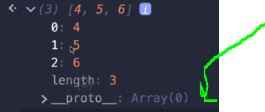
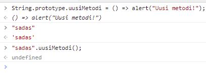

# Section 29: Prototypes, Classes, & OOP
 
Prototypes, Classes, & OOP

# What I Learned

- **Prototype**, other name -> `__proto__` references **Prototype** 
  - `[1,2,3].push(4)`, `.push()` is is defined in __proto__
  - prototype is base class to include something, like base **classe** in **Java**



- We can add own methods to string prototype

```
String.prototype.uusiMetodi = () => alert("Uusi metodi!");
```
- this can be called from any string from now on `"someString".uusiMetodi()`

- String.prototype is object itself, while `__proto__` references to this String.prototype



- Not recomended to use this way, just demonstration
- We can override `pop()` not recomended once again 

```
Array.prototype.pop = function() {
  return "I WILL NEEVER WURK T:POP FUNKTIO :D";
};
```