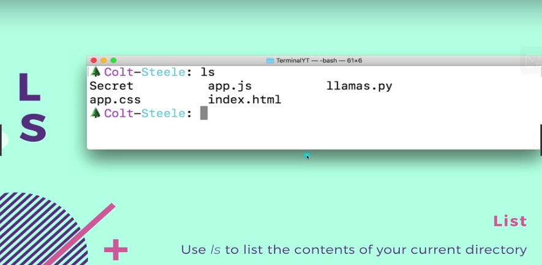

# Section 30 Mastering The Terminal

Mastering The Terminal

# What I Learned

- Now we are not just asking to return static web page, rather than site made by code!

1. Website is build dynamically
    - Dynamic responses

- **Speed** is one of benefits using cmd also having **Access** which can be powerful
- Many **Tools** are inside terminal 

1. **Terminal** is machine itself
2. **Shell** was the "program" to run different tool

- **Bash** is the most popular way to run tools

- [InstallingGIT](https://zarkom.net/blogs/how-to-install-git-and-git-bash-on-windows-9140)

1. Zsh  is called **z shell**
3. Using **bash** now!
2. We can use same command `pwd` inside different shells

- `ls` list command, lists files in directory

- `~` refers to home directory
    - We can command to go home `cd ~`

- `pwd` for listing current directory

- `cd` moving around

- if specified `..` go back ones level

1. As you can see we can see `Pets`, but if we back one level and `ls` again `Pets` folder is not to be found

2. This one not working anymore. When trying to move to folder which is **not** in same level
    - This is called **Relative path**
    - Relative can be also `cd ../../Pets`, meaning it depends on where you currently are!

- **Absolute Path**
    - `cd /Users/coltsteele`
    - No matter where you currently are, you can get into to file with **Absolute path**
- `/` **Root directory**
    - We can use it like `cd /`, tells go to **Root directory**

- So `/` for root directory and `~` for home directory

 
- Making new directory `mkdir Goats`
    
- `man` manual command, `man ls`, list how to use `ls`

1. Flags can be specified to certain commands. 
    - `q` to quit from man page

  
- `ls` with additional flag

  
- `touch` making files
    - `touch index.html`
- Touch has weird name! Its primary function is to make modifications and access time to file. Second is to create files with default permission.

  
- [touch.c](https://opensource.apple.com/source/file_cmds/file_cmds-82/touch/touch.c.auto.html) source file in mac

- Access time or modification time, with touch

- Making files with **touch** `touch app.js app.css index.html`
    - Make three files

- `rm app.css` removing file
  
