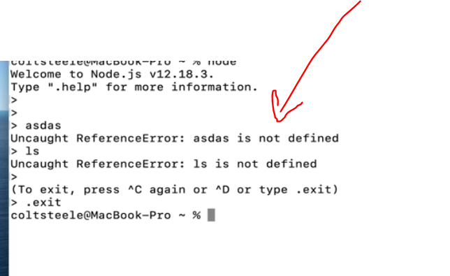
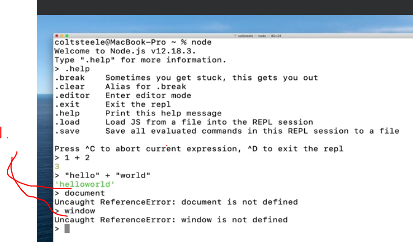
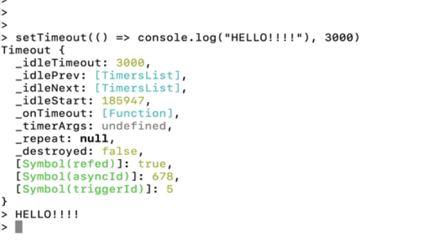
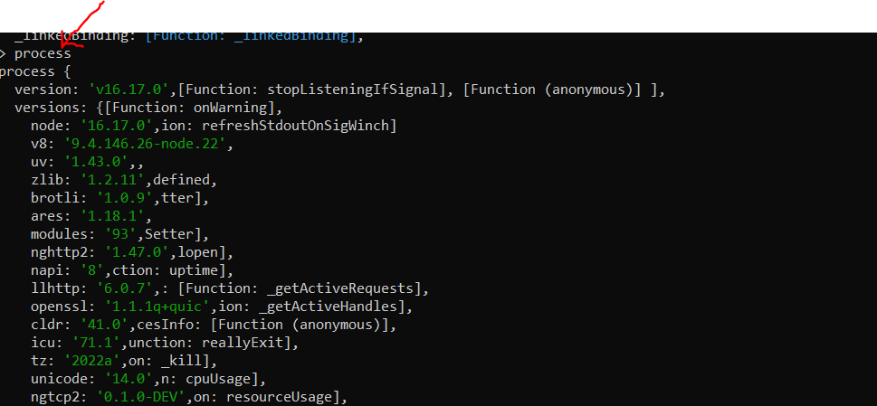
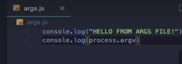

# Section 31 Our First Brush With Node

Our First Brush With Node

# What I Learned
- In past browsers job was implement Js runtime and ran inside browser
- Node in implementation of Js outside if browser. 
- You cannot write same js as inside browser

- [node](https://nodejs.org/en)

- Case where Nasa is using [Node](https://openjsf.org/wp-content/uploads/sites/84/2020/02/Case_Study-Node.js-NASA.pdf)


- [GameUsingNode](http://www.cross-code.com/en/home)

- [deploying](https://www.electronjs.org/)



- **REPL** Read–eval–print loop



- As you can see window and document object which would be inside browser world is not present here.

- global scope inside node is called global, the **global object** 



- example using `setTimeOut()` inside global object!

- [ProcessInNode](https://nodejs.org/api/process.html#process)

- You can see `process`inside node 



- There is also function inside node, example

```
> process.cwd()
'C:\\Users\\heikki'
```

- To see where node is currently running



- Using node `process.argv` from **process object**. Arguments will be retrieved

- Two ways to **read** and **create** files
    - **Asynch** version, usually need **callback** function
    - **Synch** version, waits or block other operations

- **Import** vs **require** [vs](https://www.freecodecamp.org/news/how-to-use-the-javascript-require-function/)