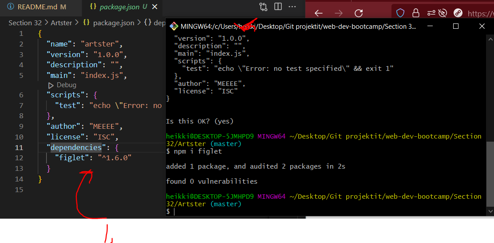

# Section 32 Exploring Modules The NPM Universe

Exploring Modules The NPM Universe


# What I Learned

- **Express** is node package!
    - Made in js

- `Require` requires some other code stuff


- When referencing something else than file we need to use `./`


- In **Node** When exporting modules, by default you need to specify what is EXPORTABLE 


- We need to write such way which things are exportable

```
module.export.add = add;
module.export.PI = PI;
module.export.squere = square;
```

- There are many ways to add exports


- When requiring folder, node will be looking `index.js` and will require those which are required in this file. This is common **requiring pattern** in Node

- We will just add this `const cats = require('./shelter')` to acquire this

- Packages which other people have written can be acquired in this way


- [give-me-a-joke](https://www.npmjs.com/package/give-me-a-joke)


- [colors](https://www.npmjs.com/package/colors)

- Meaning which version node we are using, there can be cases where we want to run Node with some specified version.  

- [cowsay](https://www.npmjs.com/package/cowsay)

- Every Node app is having `package.json`. This contains metadata about this project
    - Most important in `dependencies`

- Creating `package.json` using `npm init`



- After installing package it will be updated to `package.json`
    - This will be helpful, if I send my app to others, I don't need upload dependencies. Just `package.json`
    - Decencies should not be included in GitHub!
        - Decency section is for this one
            - Node modules should not be inculuded

- [figlet](https://www.npmjs.com/package/figlet)

- [ExampleWhereNoModules](https://github.com/dkhd/node-group-chat)


- As you can see, it's not recommended including modules into repo

- `npm install` will install required decencies

- When no need for decency, you should remove it from `package.json` to not download decency


- `require()` vs `import` instead (it's basically a different system of importing modules in JavaScript).
    - Switching these systems is not as simple as just replacing require()!