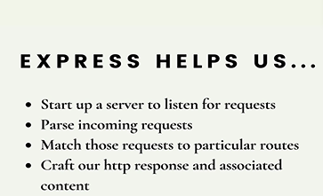
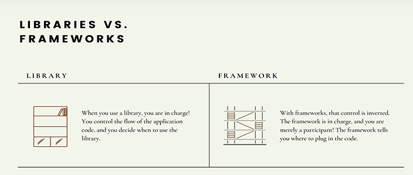

# Section 33 Creating Servers With Express

Creating Servers With Express

# What I Learned



- Express is framework



- Library is more when you wan't to call methods
 
- [ExpressHomePage](https://expressjs.com/)


```
const express = require("express");

const app = express();


app.listen(3000, () => {
    console.log("Listening on port 3000!")
})
```

- Listening port 3000 

- Listening any request

```
app.use(() => {
    console.log("We got new request");
})

```

- HTTP request is no js object. Its text

- Express automatically parses HTTP request to js object

- express bakes **request** and **result** `app.listen(3000, (req, res) => {`


- `res.send("Hello we got your request")` we can send different object, text, html to back.