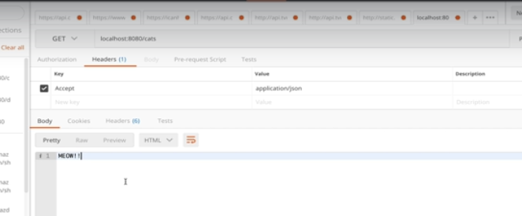
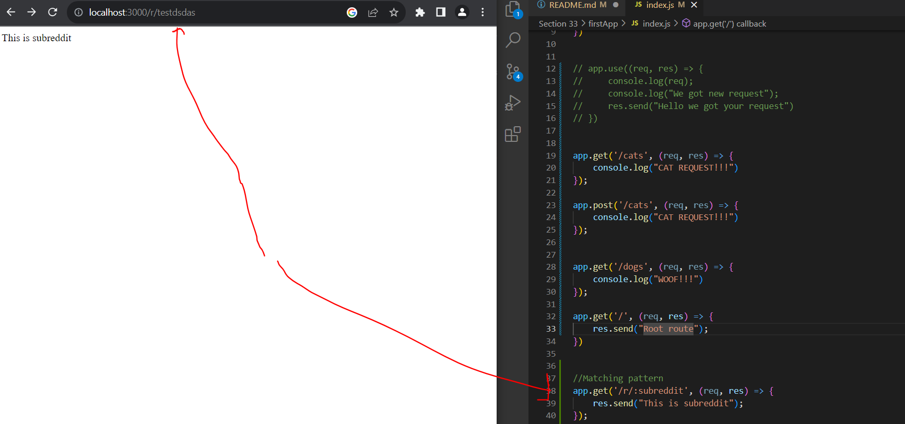

# Section 33 Creating Servers With Express

Creating Servers With Express

# What I Learned


- Express is framework


- Library is more when you wan't to call methods
 
- [ExpressHomePage](https://expressjs.com/)


```
const express = require("express");

const app = express();


app.listen(3000, () => {
    console.log("Listening on port 3000!")
})
```

- Listening port 3000 

- Listening any request

```
app.use(() => {
    console.log("We got new request");
})

```

- HTTP request is no js object. Its text

- Express automatically parses HTTP request to js object

- express bakes **request** and **result** `app.listen(3000, (req, res) => {`


- `res.send("Hello we got your request")` we can send different object, text, html to back.

- **Routing** is common task in web frameworks. Taking **incoming request** and **PATH** that is requested and matching that to some code!


- Making route in express

```
app.get('/cats', (req, res) => {
    console.log("CAT REQUEST!!!")
});
```

- Making same requests in **postman**



- **Root** route example

```
app.get('/', (req, res) => (req, res) => {
    res.send("Root route");
})
```

- Handles every other routes with `*`

```
app.get('*', (req, res) => (req, res) => {
    res.send("ALL othres");
})
```
 

- Matching patter `/r/:` will tell this route to have at least `/r/` in it

```

//Matching pattern
app.get('/r/:subreddit', (req, res) => {
    res.send("This is subreddit");
});

```

- Example using such 



```
//Matching pattern
app.get('/r/:subreddit', (req, res) => {
    console.log(req.params);
    //destructure
    const { subreddit } = req.params;

    res.send(`<h1> Browsing the ${subreddit} </h1>`);
});
```

- We can connect multiple patterns

```
//Matching pattern
app.get('/r/:subreddit/:postId', (req, res) => {
    //destructure
    const { subreddit, postId } = req.params;
    res.send(`<h1>Viewing Post ID: ${postId} </h1>`);
});

```

- Accessing query attributes

```
app.get('/search', (req, res) => {
    console.log(req.query);
    const { q } = req.query;
    
    res.send("HI");
})
```


- [nodemon](https://www.npmjs.com/package/nodemon)

- After installing, we can run `nodemon idex.js`