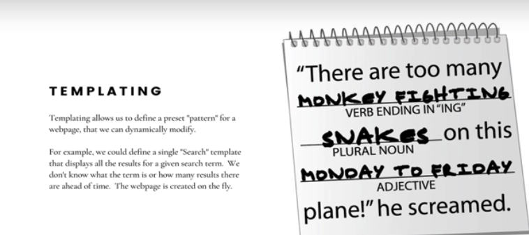

# Section 34 Creating Dynamic HTML With Templating


# What I Learned

- Tempting is answering to request. EJS embedding JavaScript into HTML



- Tempting we can embed logic and content 

- There is many templating engines, some
    - [ejs](https://ejs.co/)
    - [pugjs](https://pugjs.org/api/getting-started.html)
    - [handlebars](https://handlebarsjs.com/)

- Additional syntax

- We can send file back using `render()` in **Express**

- Tempting working


```

const { render } = require("ejs");
const express = require("express");
const app = express();

app.set('view engine', 'ejs')

app.get('/', (req, res) => {
    res.render('home.ejs'); //Sending template
});

app.listen(3000, () => {
    console.log("LISTENINT ON PORT 3000");
})


```

- `path` is node module

- Good to put into every Tempting express app `app.set('views', path.join(__dirname, '/views'));
`


- todo jäin 351 videoon aiheena teplating
