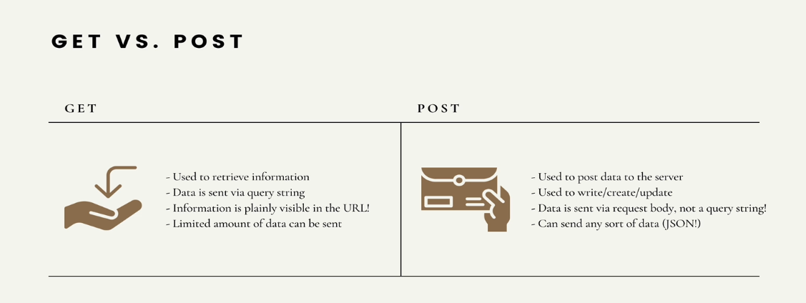
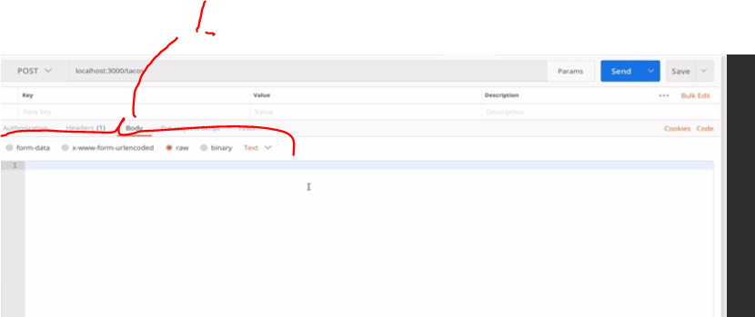
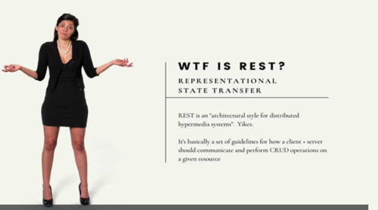
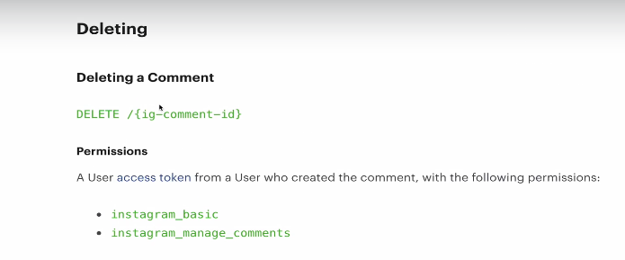
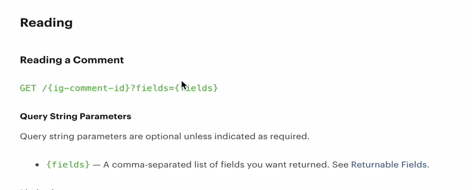
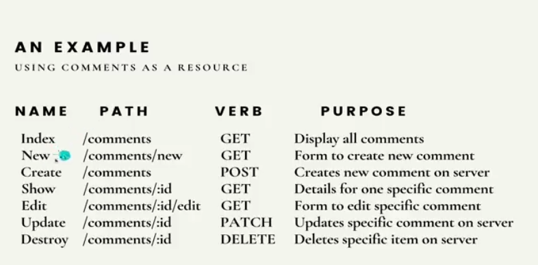
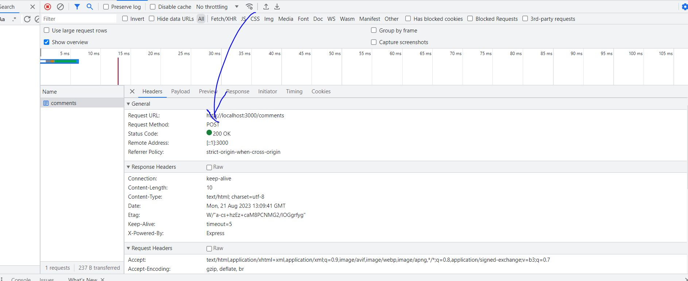

# Section 35 Defining RESTful Routes


# What I Learned

- **GET** and **POST** these are rules what you **should** follow 
    - **Get** Get information
    - **POST** Send information
    - **YOU COULD!!!** make other way, but get these recommended rules not to!



- Making GET request
    - Not usually making stuff

```
<!DOCTYPE html>
<html lang="en">
<head>
    <meta charset="UTF-8">
    <meta name="viewport" content="width=device-width, initial-scale=1.0">
    <title>Document</title>
</head>
<body>
        <form action="/tacos" method="get">
            <input type="text" name="meat">
            <input type="number" name="qty">
            <button>Submit</button>
        </form>
</body>
</html>
```


- As you can see GET is often sent with **query string** parameters

- POST is sent in BODY

```
   <h2>POST</h2>
        <form action="/tacos" method="post">
            <input type="text" name="meat">
            <input type="number" name="qty">
            <button>Submit</button>
        </form>
```

- Sending POST
    - `request.body` is having data about request. Like **GET** is having in **query string** 
    - In express [docs](http://expressjs.com/en/5x/api.html#req.body)



- 1. Body can be formatted in many ways
    - We need to tell this to express
- To parse body form **POST** we need to tell express the format how to read

`app.use(bodyParser.urlencoded({ extended: true })) // for parsing application/x-www-form-urlencoded`

- [About Rest](https://www.ics.uci.edu/~fielding/pubs/dissertation/rest_arch_style.htm)



- Sounds complicated, but it's not!
    - Just, rules and conventions how **clients** and **servers** should communicate. 

- RESTful when something complies with standard of **REST**
    - We are making routes and API:is **RESTful**
    - We can make our routes many ways, but we are going to follow RESTful way of making things

- RESTful is way how operations work in big picture. Example **Instagram** open API documentation(RESTful)





- Some github API documentation [githubAPIrest](https://docs.github.com/en/rest/gists/gists?apiVersion=2022-11-28) 

- This one some way to name our **RESTful** routes

```
GET /allcomments
GET /all
GET /showmeallcommentsnow

POST /newcomment
POST /makecomment
```

- Common way to implement RESTful API:s
    - Not only way!
- Match HTTP verbs with some common base **URL**

```
GET /comments - list all comments
POST /comments - Create a new comment
GET /comments/:id - Get one comment (using ID)
PATCH /comments/:id - Update one comment 
DELETE /comments/:id - Destroy one comment 
```

- Here is the plan, how will implement 



- Point in here is **ONE**, but common way to organize **CRUD** operations

- **index.ejs** is common naming convention


- todo heikki kts vid.366 kun 34 kappale tehnyt

- You can see **POST** inside devTools



