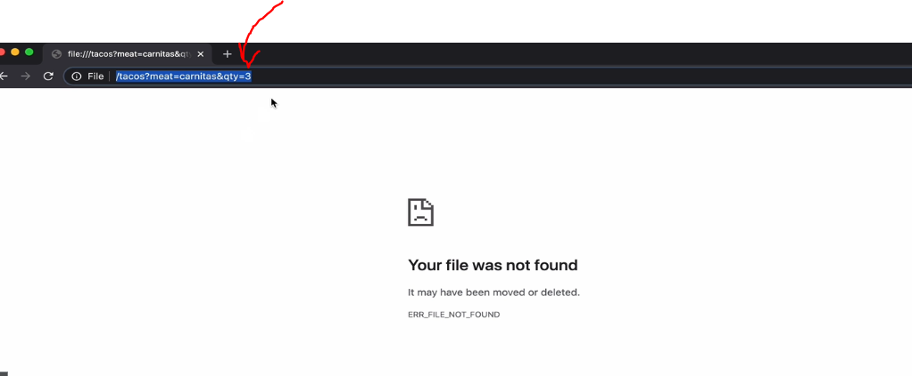

# Section 35 Defining RESTful Routes


# What I Learned

- **GET** and **POST** these are rules what you **should** follow 
    - **Get** Get information
    - **POST** Send information
    - **YOU COULD!!!** make other way, but get these recommended rules not to!


- Making GET request
    - Not usually making stuff

```
<!DOCTYPE html>
<html lang="en">
<head>
    <meta charset="UTF-8">
    <meta name="viewport" content="width=device-width, initial-scale=1.0">
    <title>Document</title>
</head>
<body>
        <form action="/tacos" method="get">
            <input type="text" name="meat">
            <input type="number" name="qty">
            <button>Submit</button>
        </form>
</body>
</html>
```



- As you can see GET is often sent with **query string** parameters

- POST is sent in BODY

```
   <h2>POST</h2>
        <form action="/tacos" method="post">
            <input type="text" name="meat">
            <input type="number" name="qty">
            <button>Submit</button>
        </form>
```

- Sending POST