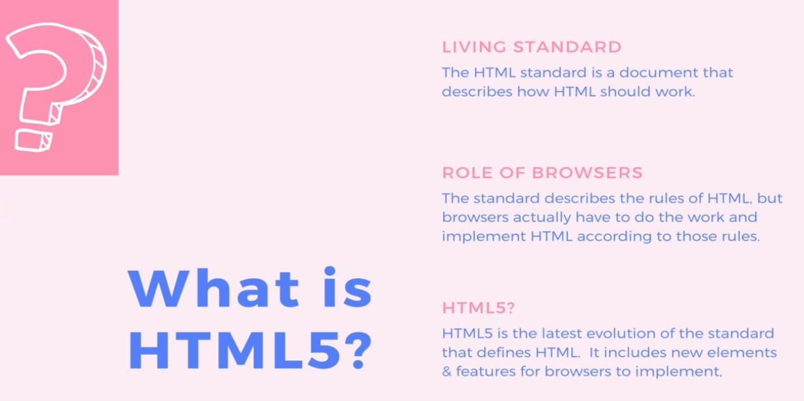
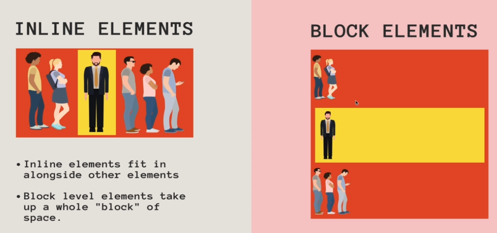
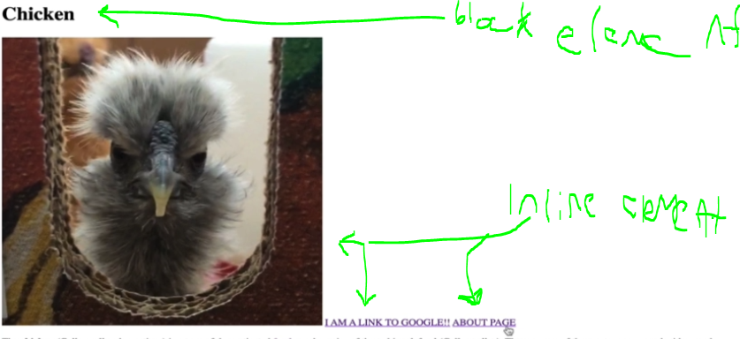
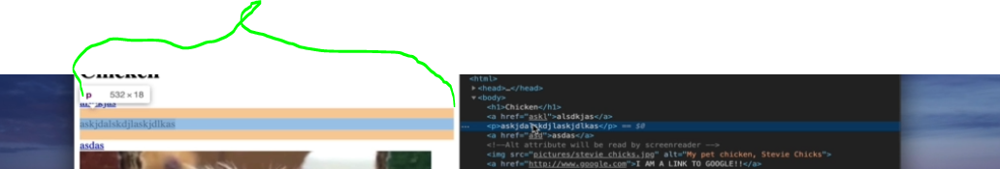
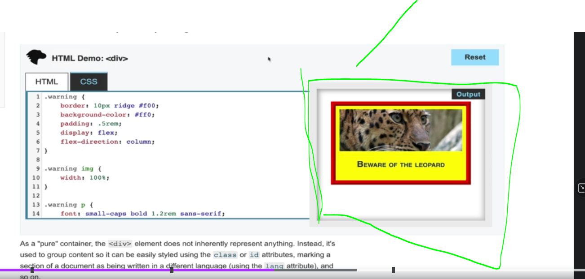
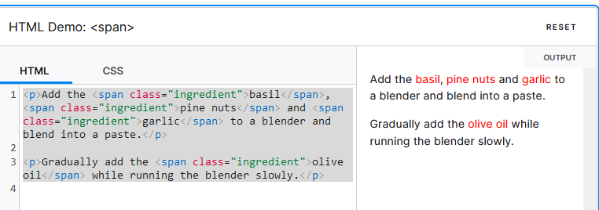

# Section 4: HTML: Next Steps & Semantics

HTML: Next Steps & Semantics

# What I Learned

- HTML5 represents two concepts
	- New version of HTML5 with new elements, attributes and behaviour
	- Larger set of technologies(3d inside browser etc)
		- Basically new stuff in HTML



- We never install html, its basically document how it should work -> called HTML standard
	- Browsers implements browsers based on these standards
- How HTML should work [HowHTMLshouldWork](https://html.spec.whatwg.org/)
	- Browser implements version of this
		- Firefox, IE, Chrome etc....



- **Block element** takes whole space
- **Inline element** fits in

- Examle below



- And how these can be seen from developer tools



- As u can see **block**, expands for while grid of space, see blue color


- While **inline** fits in with the content

- `<div>` is just generic container or to group things together
	- **Block level** element

- [div](https://developer.mozilla.org/en-US/docs/Web/HTML/Element/div)



- Using div to group text and picture togeteher
	- Used to make things together inside **block level** element

- Example using code `div`
```
	<div class="warning">
    
    <p>Beware of the leopard</p>
	</div>
```

- [span](https://developer.mozilla.org/en-US/docs/Web/HTML/Element/span)

- Span is another generic container element, but its **inline element**
	- Therefore, its good if you want to groub some stuff inside something, while keeping the layout the same. Example below



- Example adding style to these `spans`

