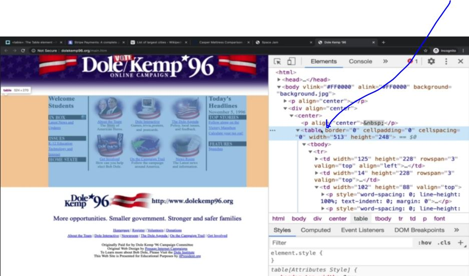
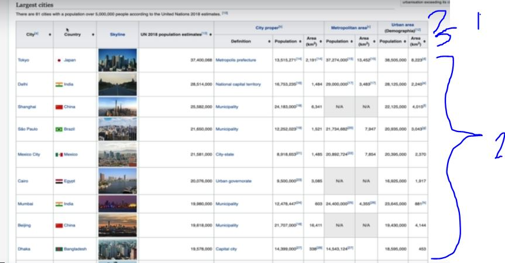
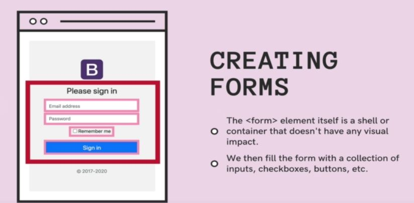
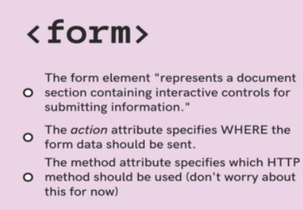
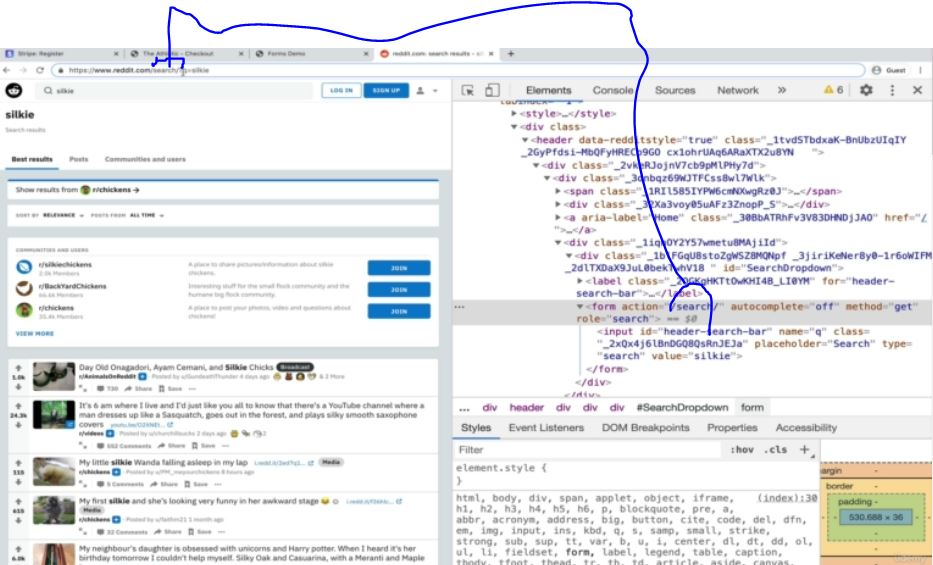
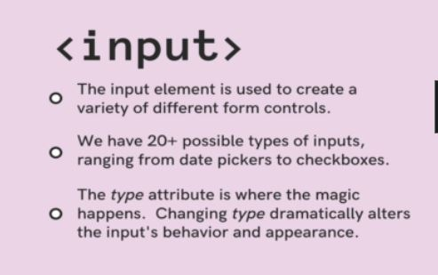
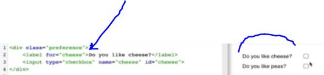
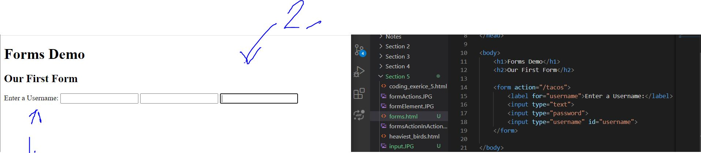
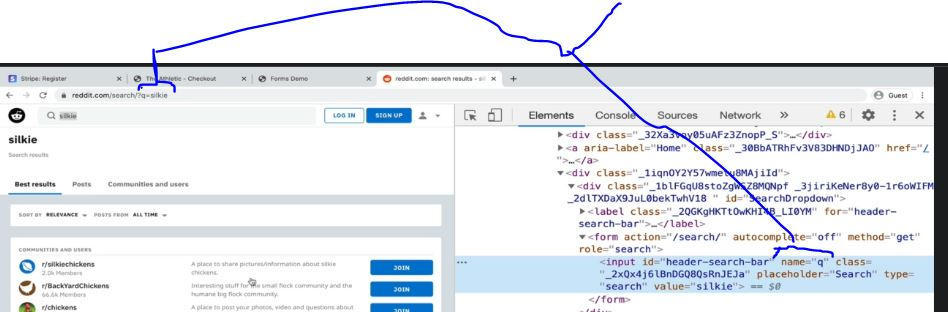

#Section 5: HTML: Forms & Tables

Section 5: HTML: Forms & Tables

# What I learned 



- In old days tables were used likes such, for layout of website
	- [Using tables to arrange website](http://www.dolekemp96.org/main.htm)
	- [Using tables to arrange website](https://www.spacejamanewlegacy.net/)
- Should not use nowadays for layouts
- Like such 
	- [Using tables to arrange data](https://en.wikipedia.org/wiki/List_of_largest_cities#List)
- [The Largest organisms' table](https://en.wikipedia.org/wiki/Largest_organisms#Heaviest_living_bird_species)
- td `tabel data or table data`, presents single cell
	- [td](https://developer.mozilla.org/en-US/docs/Web/HTML/Element/td)
- We need to group our td inside `<tr>`

```
    <tr>
        <th scope="row">Khiresh Odo</th>
        <td>7</td>
        <td>7,223</td>
    </tr>
```




1. `<thead>` Should be used for this definition for header
2. `<tbody>` Should be used for this body definition

```
    <table>
        <thead>
            <tr>
                <th rowspan="2">Animal</th>
                <th colspan="2">Average Mass</th>
                <th rowspan="2">Flighted</th>
            </tr>
            <tr>
                <th>kg</th>
                <th>lb</th>
            </tr>
        </thead>
        <tbody>
            <tr>
                <td>Ostrich</td>
                <td>104</td>
                <td>230</td>
                <td>No</td>
            </tr>
            <tr>
                <td>Somali Ostrich</td>
                <td>90</td>
                <td>200</td>
                <td>No</td>
            </tr>
            <tr>
                <td>Wild Turkey</td>
                <td>13.5</td>
                <td>29.8</td>
                <td>Yes</td>
            </tr>
        </tbody>
    </table>
</body>
```

- To manipulate, how much tables occupy space, you could use table span table row

```
           <tr>
                <th rowspan="2">Animal</th>
                <th colspan="2">Average Mass</th>
                <th rowspan="2">Flighted</th>
            </tr>
```

- Form collects different elements into one group. Each element inside **form** are called **form element**




- Specifying form actions
	- `action` where to send data



- Below demonstrating after submitting form, goes to specified URL
	- Action is making HTTP request to spiffed URL, **you could type this one out into URL** and go there manually
	


<br>



- Type specifies inputs
    - We can use **many** inputs with form

```
    <form action="/tacos">
        <input type="text">
        <input type="password">
    </form>
```

- Placeholder holds what you should input, does not work for every input field

- Labels are important inside forms, they are more than text labels indicating 
    - They are for screen readers and also text is linked to input itself. If text is clicked -> affects also the input element



- Associating label with input, we can use two approaches
    - **One** is using **id** attribute for `<input>` and use **for** `<label>`
    - **ID** should be unique 
        - Example below 
        ```

        <div class="preference">
            <label for="cheese">Do you like cheese?</label>
            <input type="checkbox" name="cheese" id="cheese">
        </div>
        ```
    - **Two** The other way. This one way less common and older way.
     This is nest these together and not use **id** and **for**
        - Example below
        ```
        <p>
            <!-- Alternative way to label an input (less common) -->
            <label>
                Enter a Number:
                <input type="number" placeholder="enter a number" name="num" min="1" max="1000">
            </label>
        </p>
        ```


- **for** in action, when text is clicked (**1.**), specified input should be focused (**2.**)



```
<!DOCTYPE html>
<html lang="en">

<head>
    <meta charset="UTF-8">
    <meta name="viewport" content="width=device-width, initial-scale=1.0">
    <title>Forms Demo</title>
</head>

<body>
    <h1>Forms Demo</h1>
    <h2>Our First Form</h2>

    <form action="/tacos">
        <label for="username">Enter a Username:</label>
        <input type="text">
        <input type="password">
        <input type="username" id="username"> 
    </form>

</body>

</html>

```

- `<button>` inside `<form>` default behavior is to submit the form 

```
     <!-- this button doesn't submit the form b/c of the "type" attribute -->
        <button type="button">Regular button (won't submit)</button>
        <!-- This button submits the form! -->
        <button>Submit!!!</button>
        <!-- So does this one: -->
        <input type="submit" value="Click Me!">
```

- `<button>` with `type=button` does not submit the form 


- **name** is associated with input when submitting the data inside form




```

    <h2>More Inputs!</h2>
    <form action="/birds">
        <input type="checkbox" name="agree_tos" id="agree">
        <label for="agree">I agree to everything</label>
        <p>
            <label for="xs">XS:</label>
            <input type="radio" name="size" id="xs" value="xs">
            <label for="s">S</label>
            <input type="radio" name="size" id="s" value="s">
            <label for="m">M</label>
            <input type="radio" name="size" id="m" value="m">
        </p>
        <p>
            <label for="meal">Please Select an Entree</label>
            <select name="meal" id="meal">
                <option value="fish">Fish</option>
                <option value="veg">Vegetarian</option>
                <option value="steak">Steak</option>
            </select>
        </p>
        <p>
            <label for="cheese">Amount of Cheese:</label>
            <input type="range" id="cheese" min="1" max="100" value="75" name="cheese_level">
        </p>

        <p>
            <label for="requests">Any Special Requests?</label>
            <br>
            <textarea id="requests" rows="10" cols="40" name="Requests?" placeholder="Type something here"></textarea>
        </p>
        <button>Submit</button>
    </form>

```

- Radio buttons only one can be selected
    - We need to associate them, we can use this making them same name example below
    ```
        <p>
            <label for="xs">XS:</label>
            <input type="radio" name="size" id="xs" value="xs">
            <label for="s">S</label>
            <input type="radio" name="size" id="s" value="s">
            <label for="m">M</label>
            <input type="radio" name="size" id="m" value="m">
        </p>
    ```
- We need use `value` when using radio buttons, problem comes when we send form forward
    - Example below
    ```
          <input type="radio" id="dewey" name="drone" value="dewey">
    ```
- `<select>` is dropdown element
    - Selects needs `<select>` 
        - With `<option>` elements

    ```
            <select name="meal" id="meal">
                <option value="fish">Fish</option>
                <option value="veg">Vegetarian</option>
                <option value="steak">Steak</option>
            </select>
    ```

- We can use slider input [range](https://developer.mozilla.org/en-US/docs/Web/API/Range)

```
<input type="range" id="cheese" min="1" max="100" value="75" name="cheese_level">
```

- Textarea input

```
  <textarea id="requests" rows="10" cols="40" name="Requests?" placeholder="Type something here"></textarea>
```

- HTML5's validations
    - There is **server** and **client** side validations
- In old days only **server** validation was common
    - Submit form → in server validate → return was it valid

- `required` attribute for input fields to front-end validation
    - Example below
    ```
          <input type="text" id="user" name="username" minlength="5" maxlength="20" required>
    ```
- We can use **build in pattern**, example in email field 
    - `<input type="email" id="email" name="email" required>`
```

 <h2>Validations Demo</h2>
    <form action="/dummy">
        <p>
            <label for="first">Enter First Name</label>
            <input type="text" id="first" name="first" required>
        </p>
        <p>
            <label for="user">Username</label>
            <input type="text" id="user" name="username" minlength="5" maxlength="20" required>
        </p>

        <p>
            <label for="email">Email</label>
            <input type="email" id="email" name="email" required>

        </p>
        <p>
            <label for="website">Website</label>
            <input type="url" id="website" name="website">
        </p>

        <button>Submit</button>
    </form>

```