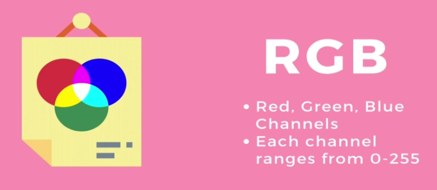
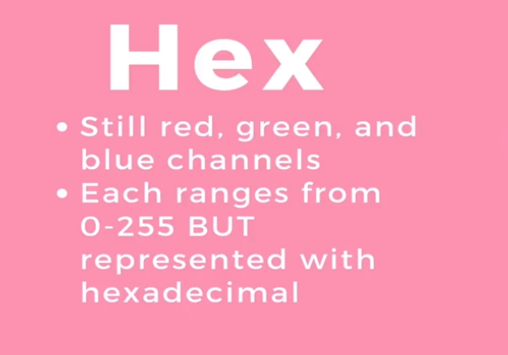
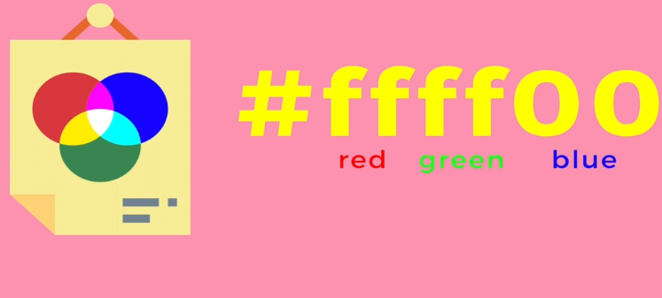
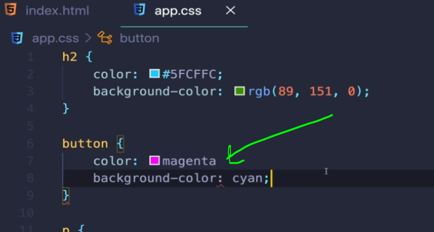
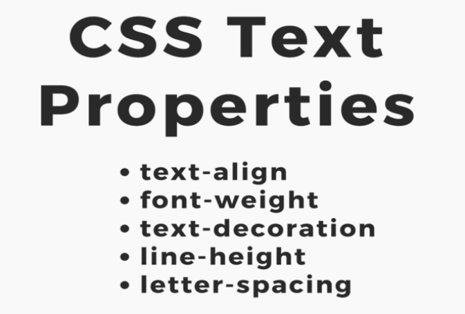
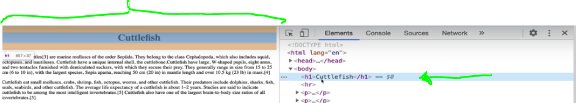
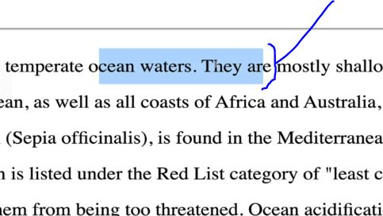
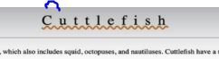
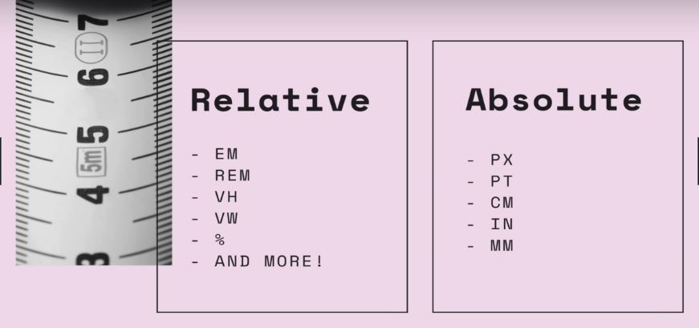
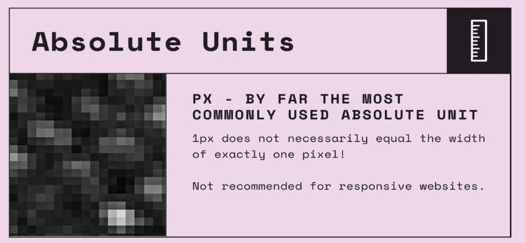

## Section 6: CSS: The Very Basics

# What I Learned


- [SelectorsExample](https://codepen.io/TurkAysenur/pen/JjGKKrP)

- Css is written as rules

- Example selector below


- 1. Input which type is text
        - `<input type="text">`
- 2. Other selector specifier


- There is so many css styles **no need to remember** them all!
    - Just learn where to find and research

- [Css](https://developer.mozilla.org/en-US/docs/Web/CSS/Reference)

- We can use **style** inside each element

`<button style="background-color: palegreen">I AM BUTTON</button>`

- Or beter way add external css


- Css has different color systems
    - RGB
    - Hexadecimal
    - HSL(not popupular)



- Recomended to use color picker
    - If comppany has **color palette** use those 

- [Color Names](https://htmlcolorcodes.com/color-names/)
- [Color Picker](https://htmlcolorcodes.com/color-picker/)



- We are using hexadecimal, because is more compact system than  





- Remember semicolons, no error in browser!

- Different common text properties. **Good to know**




- First property is `text-align`
    - Sets horizontal alligemnt on **element**
        - Not **page itself**
            - But, within given **element**
    - [Text-align](https://developer.mozilla.org/en-US/docs/Web/CSS/text-align)
    - Example below

```
h1 {
        text-align: center;
    }
```



- `<h1>` takes whole block, so wihth `text-align: center` text will be **centered!**
- `font-weight:`
    - Can be set number or keywords
- [font-weight](https://developer.mozilla.org/en-US/docs/Web/CSS/font-weight)
- `text-decoration: underline`
    - Underlines text
    - Can be more complicated than this
        - Blue underline `text-decoration: blue underline`
        - This can be used when wana stride trought or remove underline
            - `text-decoration: none`

- `line-height` height of each line of text



- Controll spaces between letters `letter-spacing` 



- Font size property controlls size of font
    - Many type to input value
    - [font-size](https://developer.mozilla.org/en-US/docs/Web/CSS/font-size)
- Some example to input font-size

```
font-size: xx-large;
font-size: xxx-large;

/* <relative-size> values */
font-size: smaller;
font-size: larger;
```
- There is different types to input units



- **Absolute** because unit size does not change regardless of its parent



- **Px** should not be used in responsive websites
    - There is better units than Pixels
        - We will learn more of them later 
- Font Family, changing font 
- Browsers have some build-in fonts
- Easy way to change font `font-family: Verdana`
- [font-family](https://developer.mozilla.org/en-US/docs/Web/CSS/font-family)
- [cssFont](https://www.cssfontstack.com/)
        