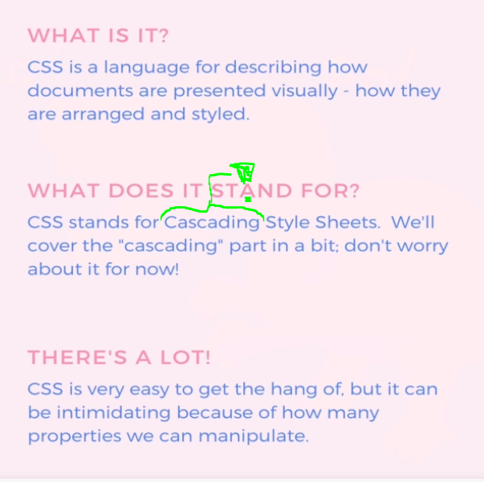
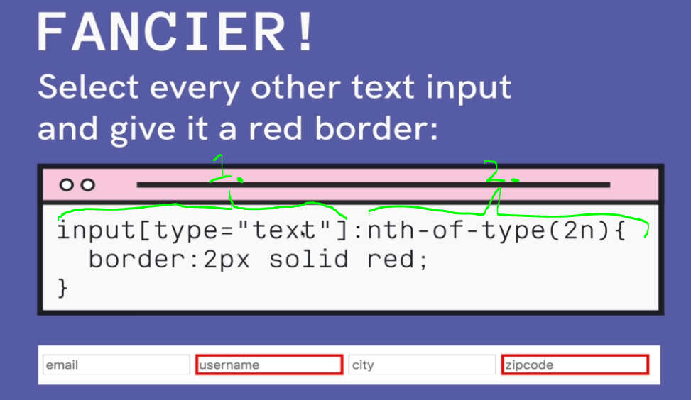
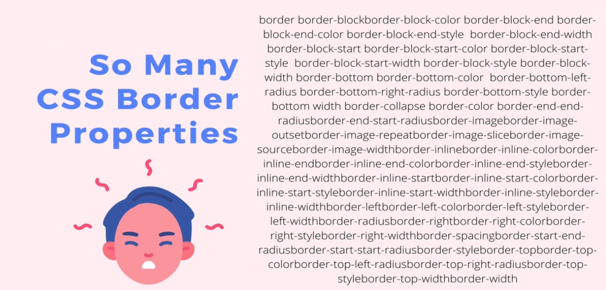
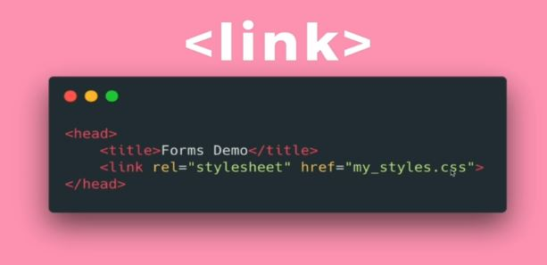

## Section 6: CSS: The Very Basics

# What I Learned

- [SelectorsExample](https://codepen.io/TurkAysenur/pen/JjGKKrP)

- Css is written as rules

- Example selector below

- 1. Input which type is text
        - `<input type="text">`
- 2. Other selector

- There is so many css styles **no need to remember** them all!
    - Just learn where to find and research

- [Css](https://developer.mozilla.org/en-US/docs/Web/CSS/Reference)

- We can use **style** inside each element

`<button style="background-color: palegreen">I AM BUTTON</button>`

- Or beter way add external css

