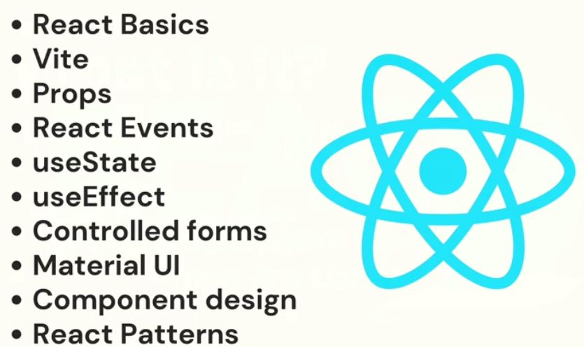
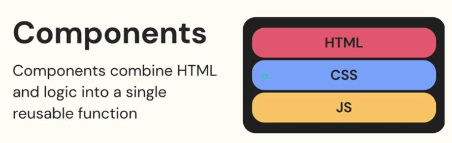
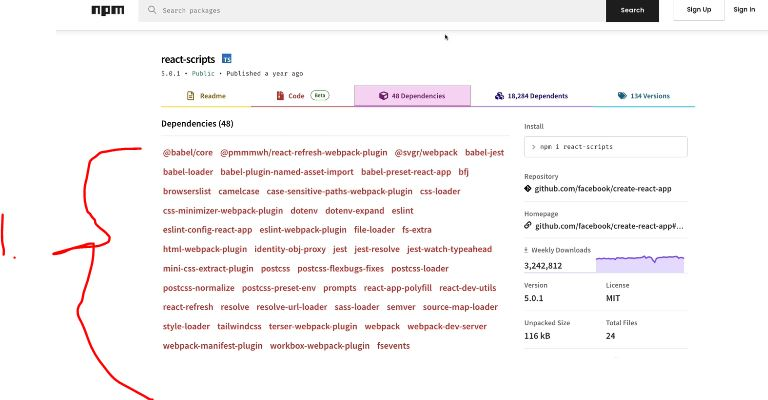
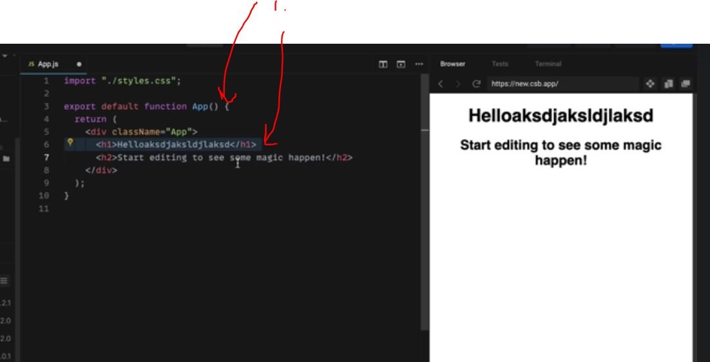
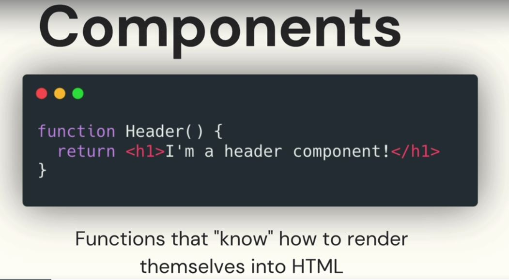
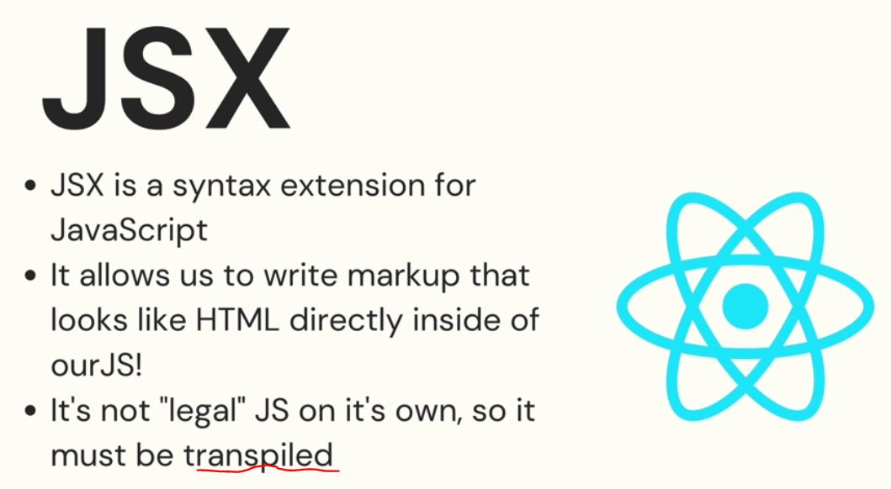
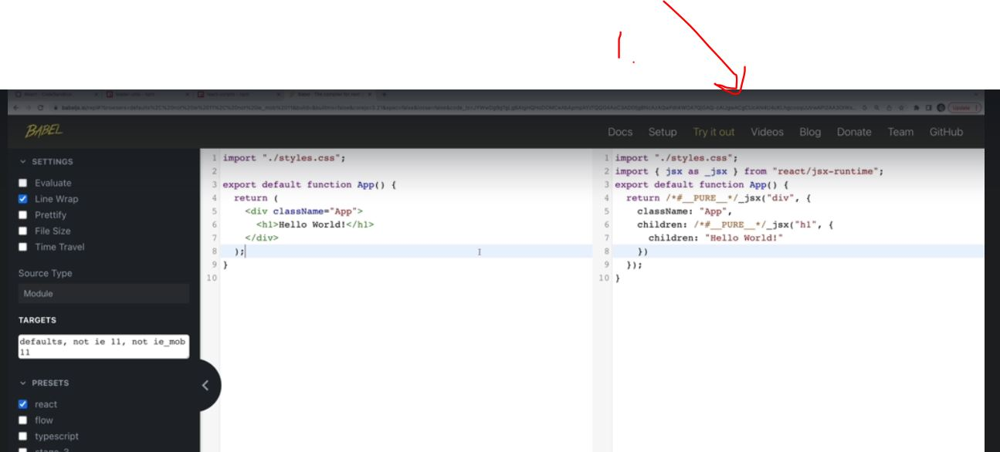

# Section 60: Introducing React
 
Introducing React

# What I Learned

- Core and minimal react features



- React lightweight library from component


- React components are combined with logic



- React components are used in other components

- React is more ecosystem is more than library

- Easiest way to get going is thought sandbox
	- [Link](https://codesandbox.io/signin?continue=/dashboard)



- 1. `react-script` includes much of decencies



- 1. HTML inside Js, normally such would brake, but not in react.


- In react we write function which knows how to render them self



- We are using **JSX** to transpile our html to js in the end



- Whiteout JSX writing html inside js would be illegal



- 1. JSX uses **Babel** to converts into **real JS** or **legal JS**

- [Babel](https://babeljs.io/)

- JSX have the lot of different rules, but it makes your life **lot of easier**

- React app structure
	- Have one **App** component and under this get other components rendered

```
import { StrictMode } from "react";
import { createRoot } from "react-dom/client";

import App from "./App";

const rootElement = document.getElementById("root");
const root = createRoot(rootElement);

root.render(
  <StrictMode>
    <App /> // LOOK HERE
  </StrictMode>
);

```

- Our React components are spitted to this `<App />` in the end of the day


```
import "./styles.css";

export default function App() {
  return (
    <div className="App">
      <h1>Hello Test</h1>
      <h2>Start editing to see some magic happen!</h2>
    </div>
  );
}
```
- We are defining our components as functions

- For making our own components we write function that returns **JSX**

- Making our component should return JSX and first letter is uppercase

- Making our first component

```
function Hello() {
  return <h1>Hello World</h1>
}
```
- Then we call it in our App 

