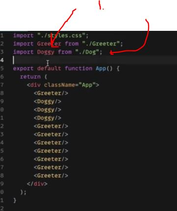
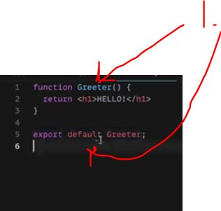
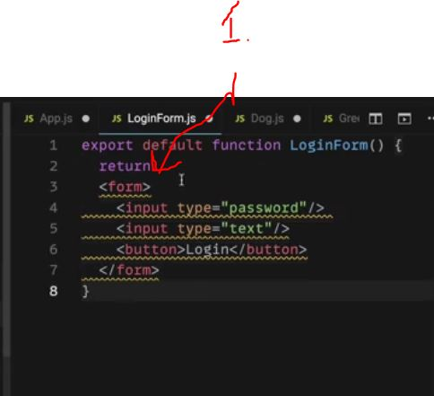
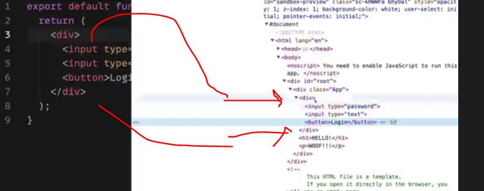
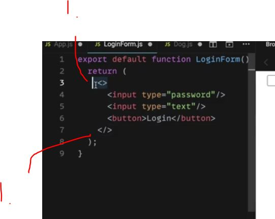

# Section 61 JSX In Detail
 
JSX In Detail

# What I Learned

- One component should be one file

- import using ES6 modules `import App from "./App";`

- we have two ways export stuff in react
	- One `export default` most common, for most of component
	- Two `export`


- Import and export is important in react app

- You can also use export without `default`
	- Example `export {}`, named export


```
Dog.js
-------


function Dog(){
	return<p>Wooof!!!</p>
}

function add(x,y)
{
	return x + y;	
}

export {Dog, add};
```

- But when importing these name needs to match exactly when using these components/functions

- [ExportAndNamedExport](https://stackoverflow.com/questions/33305954/typescript-export-vs-default-export)

- And when we are using this 

```
import {Dog, add} form "./Dog"; // these needs to match
```



- You should not rename `default exports` even if you can, bad naming habits



- 1. Component should have one default export, recommended the components name

- [LinkToProject](https://codesandbox.io/s/thirsty-allen-9yzhc4?file=/src/App.js)

- This would be perfect html tag, but not working with **JSX**
  - component should enclose with **/**
`<input type="password">`

```

export default function LoginForm() {
  return <input type="password"/>
}

```

- This on is fine 


- Component should return **one single element**, example below should not work

```
export default function App() {
  return (
    <input type="password"/> <input type="text"/>
  );
}
```

- What you should do is, make them inside one element example using `<div>` or `<form>`

```
export default function App() {
  return <div>
    <input type="password"/>
    <input type="text"/>
  </div>
}
```


- This is valid and working, but **.js**
  - To make js happy about this, we need to enclose it with parenthesis



- Fixed, this is a common way to wrap around element


- This will clutter **DOM** with unnecessarily enclosing elements
  - Example extra `<div>`: s are created



- **React fragment** empty fragment, will not resolve in any markup. `<> AND </>`



- 1. React Fragments, use them when if you don't want extra enclosing elements in **DOM**

- We can use `{}` to make our JS expression code evaluate inside JSX in real-time and turn them in to string.  
  - This is kinda same as Js Literal template `${}`, but `{}` is for JSX usage
- Example below

```

function Dog() {
  return <p> {1 + 1} WOOOOF!!!</p>;
}

```

- In React app we want to create small react components and build our application website from there 

- We should make big component from our bigger one 

- This is illustration of the concept in react, from smaller ones to bigger one

- **From**

```
import "./styles.css";
import Greeter from "./Greeter";
import Dog from "./Dog";
import LoginForm from "./LoginForm";
import Die from "./Die";

export default function App() {
  return (
    <div className="App">

    <Die/>
    <Die/>
    <Die/>
    
    </div>
  );
}
```

- **Changes to**

```
import Die from "./Die"; // This one has now one depedency
export default function DiceRoll() {
  return (
    <div className="DieRoll">
      <h1>Dice Roll </h1>
      <Die/>
      <Die/>
      <Die/>
    </div>
  )
}
```

- And

```
import "./styles.css";
import Greeter from "./Greeter";
import Dog from "./Dog";
import LoginForm from "./LoginForm";
import Die from "./Die";
import DiceRoll from "./DiceRoll";

export default function App() {
  return (
    <div className="App">
     <DiceRoll />
    </div>
  );
}
```

- Styling our class can be tricky.
  - `<h2 class ="someClass">` this one is perfect **valid** HTML
  - In **JavaScript** it is reserved word. We need to use `className` like following `<h2 className="someClass">`
  
  - It's common to write **.css** file per component. Example React Component **Die.js** gets **Die.css**
    - In HTML world you would use like `<link rel="stylesheet" href="styles.css">` inside HTML tag, but **not** in react world
    - Since React uses **webpack** (bundling our code together, making our import and export work). We need to import our CSS in React
      - `import "./Die.css";` we need to add such to our **Die.js** component (**this is convention!**). This tell webpack to import it to project. We could use this outside of the component, as long is included somewhere.

