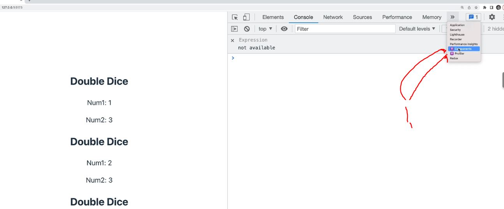
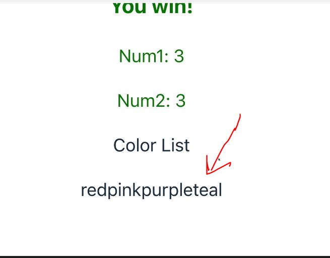
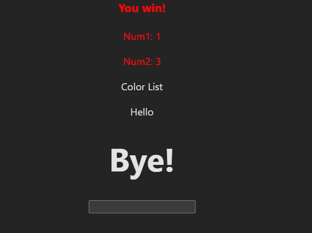

# Section 63 Working With Props

Working With Props

# What I Learned

- One of essential concept of **React** is **PROPS**

- Prop allows us to write components which **expects arguments**


- 1. `Greeter` is defined as function, think as these are pushed as argument `name`


- When using `vite` should use windows `cmd` than git bash, since its bit buggy with this

- Using **props**
    - First we pass it in, as name `person`

```

function App() {

  return (
    <div>
      <Greeter person="Bill"/>
      <Greeter person="Jacky"/>
    </div>
  )
}

```

- Then we use it inside our React component
    - Remember to input as parameters
    - We can use `{props.person}`, `person` is name which we specified in when inputting **props**

```

function Greeter(props) {
    return <h1>Hi there, {props.person}!!!</h1>;
}

export default Greeter;

```
- We often deconstruct them like such

```

function Greeter({person}) {
    return <h1>Hi there, {person}!!!</h1>;
}

export default Greeter;

```

- Multiple props
    - First we pass is as previously
```

function App() {

  return (
    <div>
      <Greeter person="Bill" from="Colt 2"/>
      <Greeter person="Jacky" from="Colt"/>
    </div>
  )
}

export default App

```

- And its usage

```

function Greeter({person, from}) {
    return (
    <>
        <h1>Hi there, {person}!!!</h1>
        <h2>-{from}</h2>
    </>
    );
}

export default Greeter;

```

- We can use non string props as such, evaluate using JSX `{}` syntax `<Die numSides={19} />`
- And use such as logic

```

function Die({ numSides}) {
    const roll = Math.floor( Math.random() * numSides) + 1;
    return (
    <p>
        {numSides}-sided Die roll: {roll}
    </p>
    );
}

export default Die;

```

- Adding default prop with `decontructed value="default value here"`. Example `function Greeter({person="everyone", from="anonymous"}) {`

- Passing array `<ListPicker values={["a","b","c"]} />`

- Passing JavaScript Object `<ListPicker values={{a:1, b:2}} />` **Don't confuse**
`<ListPicker values={} />` **This is syntax to escape JSX**  

-  One way writing conditional logic into React component `{num1 === num2 ? <h3>You win!</h3> : null}` or other way `{num1 === num2 && <h3>You win!</h3>}`

- If using **React** you should install react developer tools [ReactDeveloperTools](https://chrome.google.com/webstore/detail/react-developer-tools/fmkadmapgofadopljbjfkapdkoienihi)



- 1. You can see component tools inside developer tools

- Making **dynamic styles**

- `const styles = { color : "purple" };`
    - We can `styles` is expecting styles object
- `<div className="DoubleDice" style={styles}>` Styles takes in **object**

- If you want to have **dynamic styles** use `const styles = { color : num1 === num2 ? "green" : "red" };`

- Rendering pure array in **JSX** `<p>Color List</p> <p>{colors}</p>`



- We can render hard coded values with **JSX**

```
function ColorList({colors}) {

    const elements = [<p>Hello</p>, <h1>Bye!</h1>,<input type="password" />]
    return (
        <div>
            <p>Color List</p>
            {elements}
        </div>
    );
}


export default ColorList;
```

- Every value will get rendered individually in **JSX**

s

- Its **common** take our list and map into between `<h1></h1>` and render it

```
function ColorList({colors}) {
    // const elements = [<p>Hello</p>, <h1>Bye!</h1>,<input type="password" />]
    const list = colors.map(color => <li>{color}</li>); // takes each color and maps it between <li> element

    return (
        <div>
            <p>Color List</p>
            <ul>{list}</ul>
        </div>
    );
}


export default ColorList;
```
- Using **.map** this it **god and grain** in react. They use it a lot!