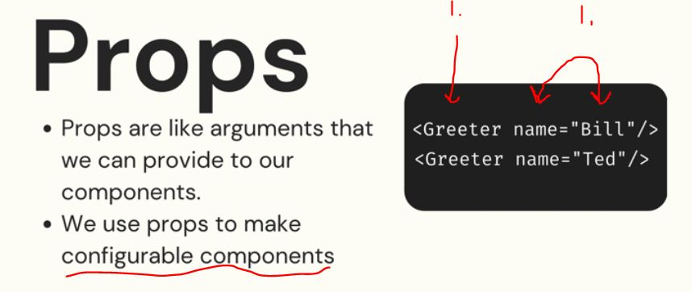

# Section 63 Working With Props

Working With Props

# What I Learned

- One of essential concept of **React** is **PROPS**

- Prop allows us to write components which **expects arguments**



- 1. `Greeter` is defined as function, think as these are pushed as argument `name`


- When using `vite` should use windows `cmd` than git bash, since its bit buggy with this

- Using **props**
    - First we pass it in, as name `person`

```

function App() {

  return (
    <div>
      <Greeter person="Bill"/>
      <Greeter person="Jacky"/>
    </div>
  )
}

```

- Then we use it inside our React component
    - Remember to input as parameters
    - We can use `{props.person}`, `person` is name which we specified in when inputting **props**

```

function Greeter(props) {
    return <h1>Hi there, {props.person}!!!</h1>;
}

export default Greeter;

```
- We often deconstruct them like such

```

function Greeter({person}) {
    return <h1>Hi there, {person}!!!</h1>;
}

export default Greeter;

```

- Multiple props
    - First we pass is as previously
```

function App() {

  return (
    <div>
      <Greeter person="Bill" from="Colt 2"/>
      <Greeter person="Jacky" from="Colt"/>
    </div>
  )
}

export default App

```

- And its usage

```

function Greeter({person, from}) {
    return (
    <>
        <h1>Hi there, {person}!!!</h1>
        <h2>-{from}</h2>
    </>
    );
}

export default Greeter;

```

- We can use non string props as such, evaluate using JSX `{}` syntax `<Die numSides={19} />`
- And use such as logic
```
function Die({ numSides}) {
    const roll = Math.floor( Math.random() * numSides) + 1;
    return (
    <p>
        {numSides}-sided Die roll: {roll}
    </p>
    );
}

export default Die;
```

- Adding default prop with `decontructed value="default value here"`. Example `function Greeter({person="everyone", from="anonymous"}) {`