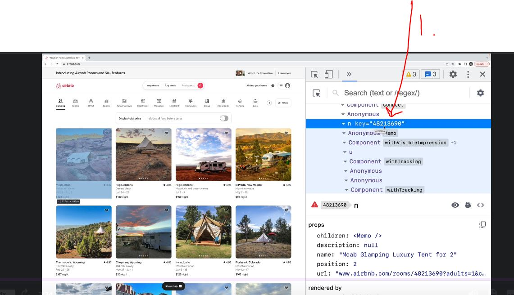

# Section 64 Shopping List Demo: keys, prop types, and more!

Shopping List Demo: keys, prop types, and more!

# What I Learned


- Missing key in list from each child element
    - In **React** world needs key for every element to keep track of every element 

- List can **survive** whiteout keys, but when they get modified or re-ordered, things get problematic 
    - We can add **hard coded** id into data, since we can assume that this data coming from database has this kind of **UID**

```
const data = [
    { id : 1, item : "eggs", quantity : 12, completed : false },
    { id : 2, item : "milk", quantity : 1, completed : true },
    { id : 3, item : 'chicken', quantity : 4, completed : false },
    { id : 4, item : 'carrots', quantity : 6, completed : true },
];
```

- And add this to looping function when iterating over this list of data. Usage of react **key** prop

```
  {items.map((i) => (
            <li key={i.id} 
            style={{
                color: i.completed ? "gray" : "red",
                textDecoration : i.completed ? "line-through" : "none",
            }}
        >
            {i.item} - {i.quantity}
        </li>
```



- 1. Even **AirBnb** has unique key prop in baked in to their system

- In **React** you should make many small components rather than one big one. Reason is usability


- You should get used to thinking to abstract logic into smaller pieces. For example if **delete button** would get introduced it should be in separate class file

- © some smart guy in Udemy forum
> The key prop in React is special and is used by React's diffing algorithm for performance optimization. It's not meant to be used as a normal prop, and it won't be passed down to the component. Therefore, when we destructure the props in the ShoppingListItem component, the key prop is not included because it's not part of the props object that's passed into the component.
