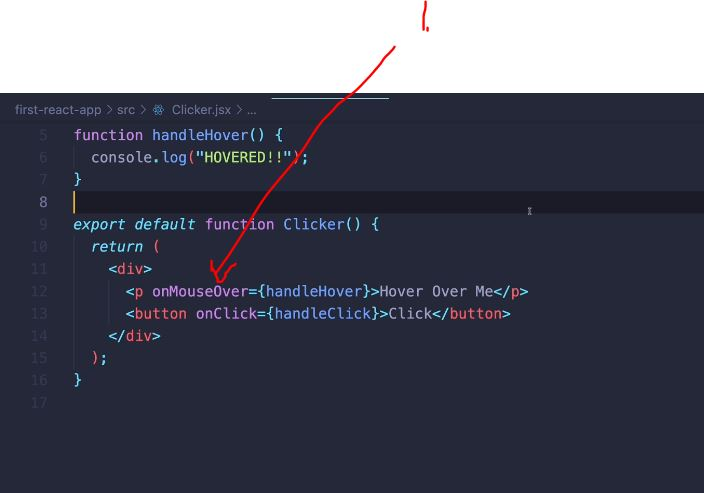

# Section 65: React Events
 
React Events

# What I Learned

- DOM way to make event listener, is using query selectors and add our own event listener to it!


```
function handleClick() {
    console.log("clicked");
}


function Clicker() {
    return(
        <div>
            <p>Click The Button</p>
            <button onClick={handleClick}>Click</button>
        </div>
    )    
}


export default Clicker;

```
- React event `onClick` is most common one
- In React world you define click function **inline**
    - It is VERY important to pass it as reference, not as executing function as following `<button onClick={handleClick()}>Click</`. This would execute function

- Example events defined inline 



- When submitting form, page gets refreshed by **default**


- Preventing event submission like in our VanillaJs, its same like in React.
```

function handleFormSubmit(eventObject) { // Event handler will be provided with event submission. In vanilla Js or in React 
    eventObject.preventDefault();
    console.log("Submitted the form");    
}


function Form() {
    return (
        <form onSubmit={handleFormSubmit}>
            <button>Submit</button>
        </form>
    );
}

export default Form;

```