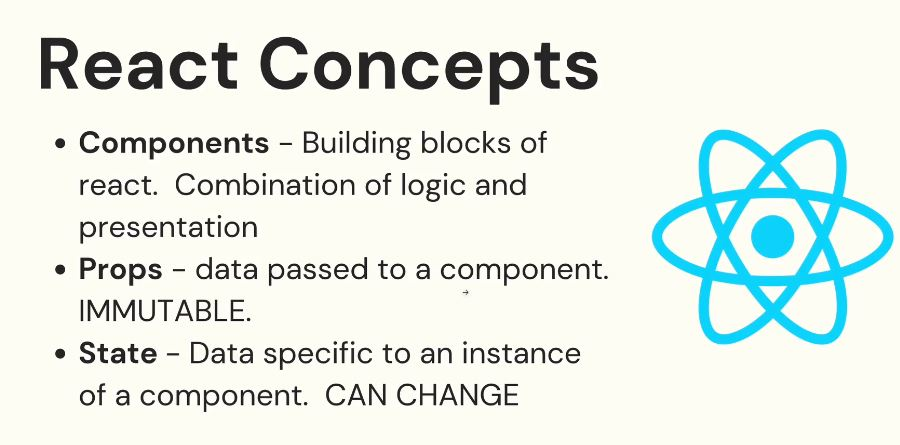
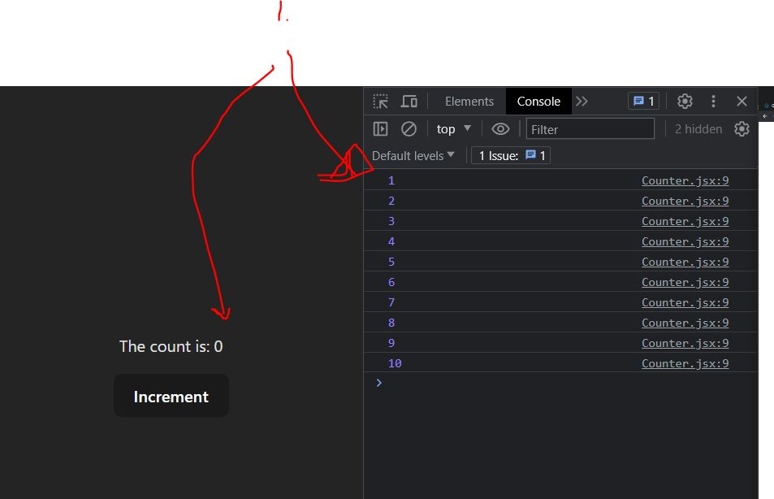
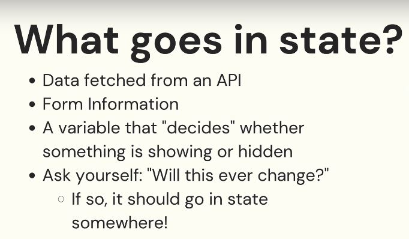
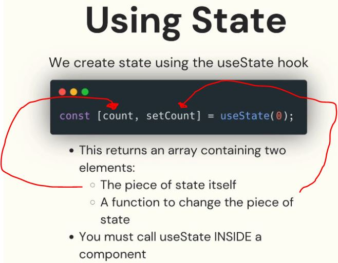
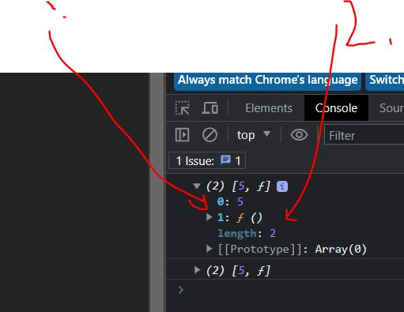
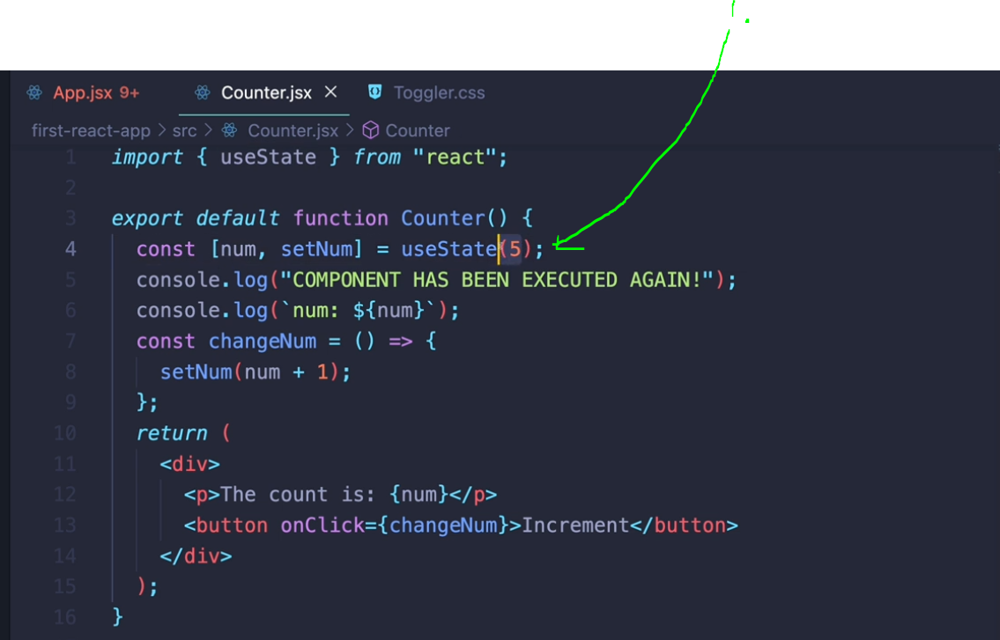

# Section 66 The Basics of React State: 
 
The Basics of React State

# What I Learned



- **Props** are **immutable**
    - Props are not supposed to be changed
- **States** are supposed to change
- 1. Why we need states
    - Even if counter is updating. The **DOM** is not updating
    - This boils down to when and how React renders our **view**




- We want to tell React **re-reander** **view**
    - This can be achieved using **states**



- When ever **state** update or modified, view is redrawn for given components

- Its takes time get response from API

- It's important in **React** when to use state and when not to use

- React gives us **hooks** which we can implement to our software
    - Hooks start with `use` 
    - Maybe most used one is **useState**




- State is state variable which we use in our component, we need to import it
- Gets initial value `useState(1)`

- First, is state itself(**count**)
- Second, function to **change** state
- [HooksInReact](https://react.dev/reference/react/useState)



- 1. The first one which we setted it
- 2. Second is **function** which is used to change it

- Therefore we could use this

```
const num = arr[0];
const setNum = arr[1];
```
- It's common to de-tructure the result

```
const [num, setNum] = useState(5);
```

- Using state.

```
import { useState } from "react";

function Counter(){

    const [num, setNum] = useState(5);
        
    const changeNum = () => {
        setNum(num + 1);
    }

    return (
        <div>
            <p>The count is: {num}</p>
            <button onClick={changeNum}>Increment</button>
        </div>
    );
}

export default Counter;
```
- When state function is run, react knows re-render our components



- 1. useState is once set to 5 even if our function is ran multiple times