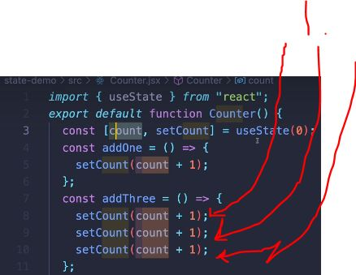
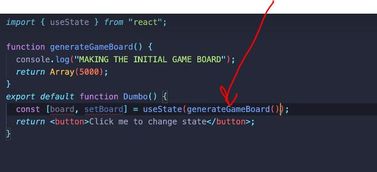
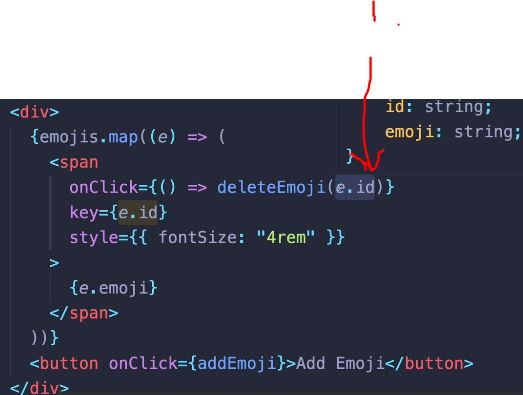

# Section 67 Intermediate State Concepts

Intermediate State Concepts

# What I Learned


- Wrong way updating state, where new state depends on **old state**


```

import { useState } from "react";


function Counter() {
    const [count, setCount] = useState(0);

    const incrementCount =
     () => {
        setCount(count + 1);
    }

    return (
        <div>
            <p>Count: {count}</p>
            <button onClick={incrementCount}>+1</button>
        </div>
    );
}

export default Counter;

```



- 1. Problem comes when multiple statements are occurring, **remember** state is update when view is re-rendered!

- Should do this instead, **callback syntax**

```

    const incrementCount = () => {
        setCount(c => c + 1);
        setCount(c => c + 1);
        setCount(c => c + 1);
    }

```



- Even `useState` is run first `generateBoard()` is run multiple times!

- Should be passed as function reference `const [board, setBoard] = useState(generateGameBoard);`

- React won't force re-render if we use same number in `setCount()`

- React `setCount()` with object is looking objects Identity

```
const blach = [1,2,3]
blach.push(4);
```

- In Js **blach** is same when comparing

- **Mutable objects** which have been changed needs to be state with **new object**

- Using **spread operator** creates **new** copy
    - and using **callback syntax** when using state which **depends on old state**


```

function increaseP1Score() {
    setScores(scores);
    scores.p1Score += 1;
    console.log(scores);
    const newScores = {...scores, p1Score :scores.p1Score + 1 }; // spread operator
    setScores(newScores);
}

```

- It's common to have **array methods** in React

- UID is recommended when deleting something from list. To identify certain element.

- Library generating [UID](https://www.npmjs.com/package/uuid)

- Setting UID to list

```

import { useState } from "react";
import { v4 as uuid } from "uuid";

function EmojiClicker(){

    const [emojis, setEmojis] = useState([{ id : uuid(), emoji : "😊" }]);
    
    const addEmoji = () => {
        setEmojis((oldEmojis) => [...oldEmojis, {id: uuid(), emoji : "😘"}]); //Copy of old array based new array
    }

    return (
        <div>
            {
                emojis.map(e => <span key={e.id} style={{ fontSize : "4rem"}}>{e.emoji}</span>)
            }
            <button onClick={addEmoji}>Add Emoji</button>
        </div>
    )
}

export default EmojiClicker; 

```



- 1. Every element(emoji) has `e.id` baked in when clicking
    - Remember to use arrow function when defining inline function 
- Most popular way to delete is `.filter` method

- `emojis.filter(e => e.id !== id);` makes copy of old array where specified id is removed
    - Most **reacty** way to delete something

```
import { useState } from "react";
import { v4 as uuid } from "uuid";

function EmojiClicker(){

    const [emojis, setEmojis] = useState([{ id : uuid(), emoji : "😊" }]);
    
    const addEmoji = () => {
        setEmojis((oldEmojis) => [...oldEmojis, {id: uuid(), emoji : "😘"}]); //Copy of old array based new array
    }

    const deleteEmoji = (id) => {
        setEmojis((prevEmojis) => {
            return emojis.filter(e => e.id !== id);
        })
        // delete the emoji with the spesific id
    }

    return (
        <div>
            {
                emojis.map(e => 
                <span onClick={() => deleteEmoji(e.id)} key={e.id} style={{ fontSize : "4rem"}}>
                {e.emoji}
                </span>
                )}
            <button onClick={addEmoji}>Add Emoji</button>
        </div>
    )
}

export default EmojiClicker; 
```

## Common patters manipulating arrays

- Adding in most **React** way `[...shoppingCart , { id : 4, product : "Cofee Mug", price : 2.99 }];`

- Removing from array `shoppingCart.filter((item) => item.id !== 2);`

- Updating all elements in an array

```
shoppingCart.map((item) => {
    return  {
        ...item, 
        product: item.product.toLocaleLowerCase(),
    }        ;
});

```

- Modifying particular element in an array 

```

shoppingCart.map((item) => {
    if (item.id === 3) {
        return {...item, price : 10.99 };
    } else {
        return item;
    }
});

```

- Remember to make **copy** of an array then modify it