## Section 7: The World of CSS Selectos

# What I Learned

- There is many different selectors


- **Universal Selector**, selects all
    - Not very common
```
* {
    color: black;
}
```

- **Element Selector**, selects all spesifed img elements
    - Very common
```
img {
    widyh: 100px;
    height: 200px;
}
```


- **Selector list**, selects both h1 and h2, seperated by comma

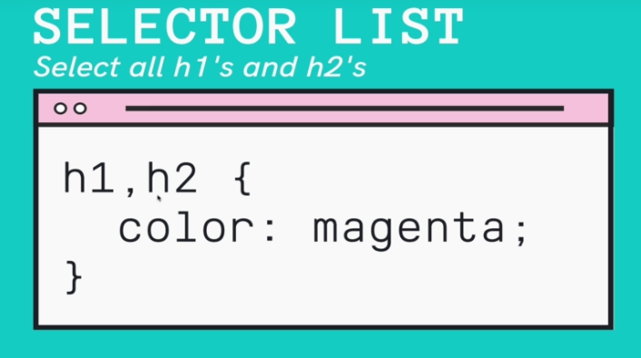

- **ID selector**

- Id usefull to spesify unique element
    - Id selectors should keep minumum as possible, there is better selectors, but these are good nonetheless

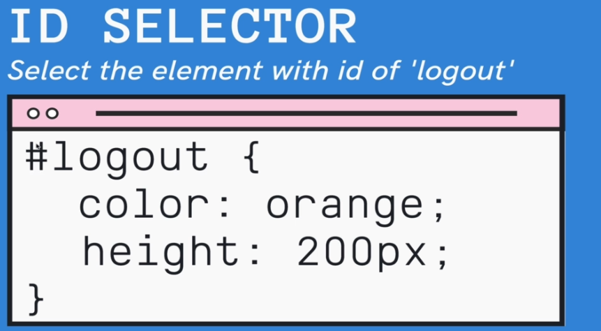

- You can me your own color palette

- [Color palettes](https://coolors.co/palettes/trending)

- **Class Selector**

- Class selector uses `.`
    - Affects elemts with class tag
    - todo laita kuva
```
.complete {
    color: white;
}
```

- Descendant Selector

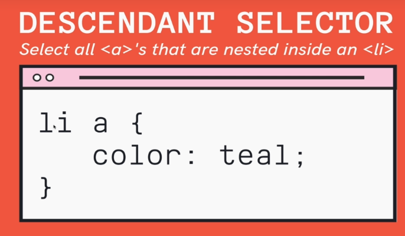

- Uses space between
- Selects all `<a>` nested inside `<li>` 

```
span a {
    color: red;
}
```

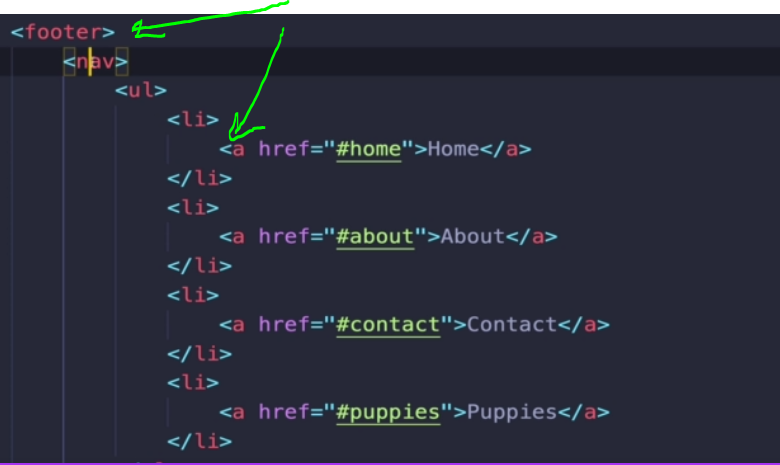

- Descendant selectors looks below first level untill it reaches point or the end. In this case finds `<a>` which is not clearly at first descendant
 
```

footer a {
    color: red;
}

```

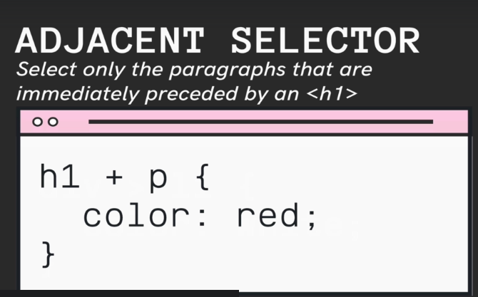

- Selects all `<p>` which comes after `<h1>`
    - Need to be in same level

- In HTML

```
<input type="text" placeholder="search" id="search">
<button>Log In</button>
```

```
input + button {
    background-color: pink;
}
```

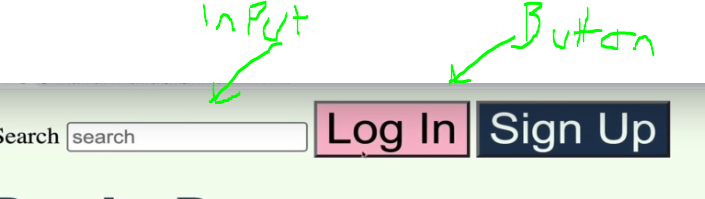

- Adjacent Selector would work like such

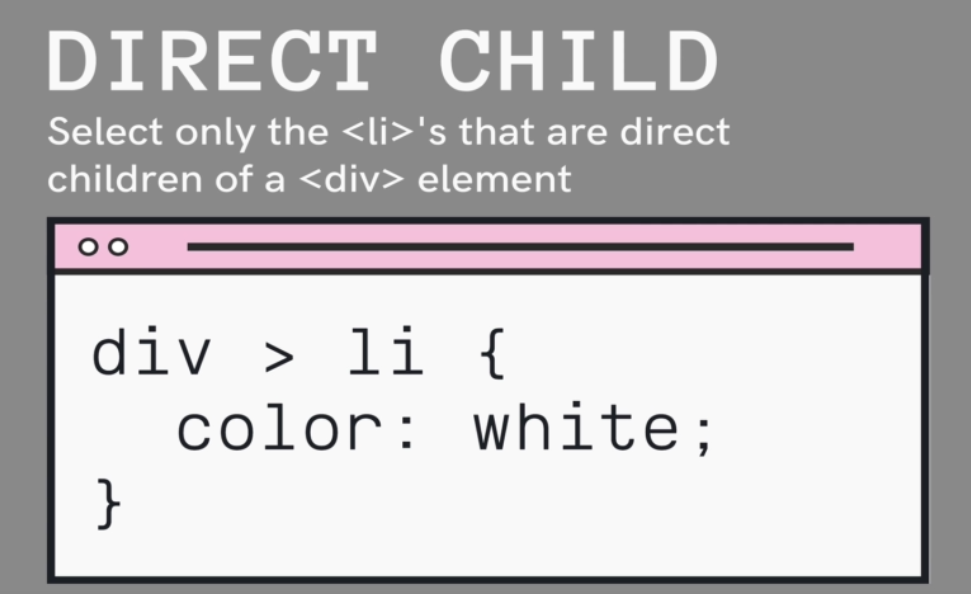

- We use `>`, li:s which are direct childs of div, will be selected 

```
footer > a {
    color: #457b9d;
}
```
- Below Direct Child in action
    - Looks element `<a>` which has to be direct child of `<footer>`

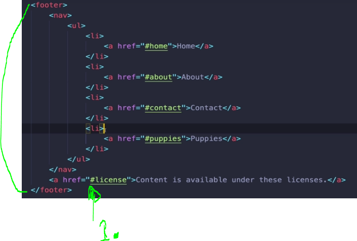

1. Only last `<a>` should get affected.

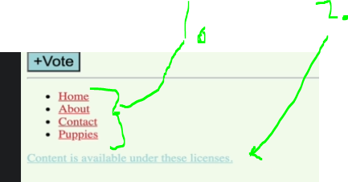

- As you can see last **2.** `<a>`, will get affected not `<a>` in **s1.**


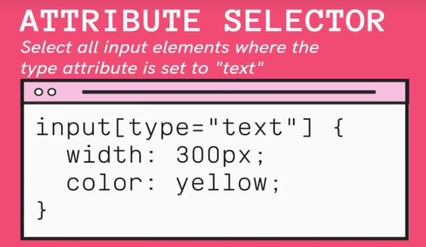

- Selects based on attribute 

```

input[type="password"] {
    color: green;
}

```

- Example using Attribute Selector Following element would be selected and made to green

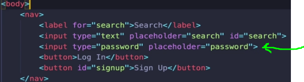

- [Attribute selectors](https://developer.mozilla.org/en-US/docs/Web/CSS/Attribute_selectors)

- `input[type="password"] ` common usage of AttributeSelctor

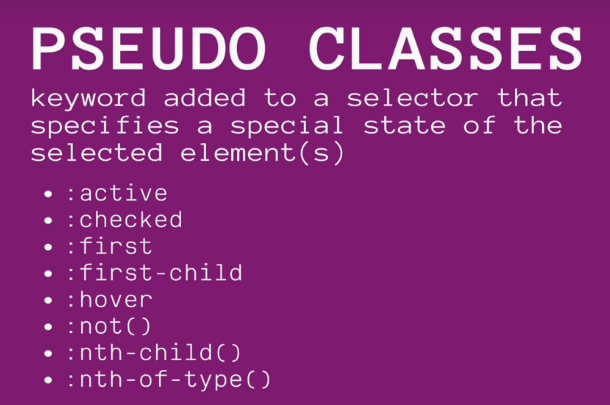

- **pseudo-class** Gives extra modifiers to selected element with selectors
    - They start with `:`
    - Some examples below
    - They are states

- `:hover` when element is hovered over
    - Hover is very common

```

button:hover {
    background-color: red;
}

```

- `:active` when element active, cliked example

- In chrome DevTools you can inspect these states and force them on given element

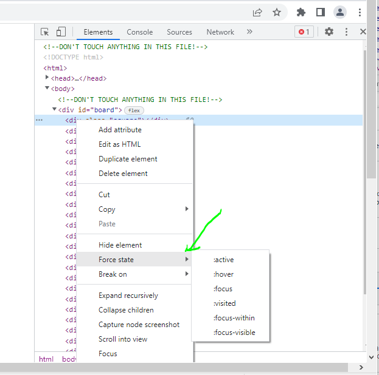


- [Pseudo-classes](https://developer.mozilla.org/en-US/docs/Web/CSS/Pseudo-classes)


- `:end-of-type` helps select nth element, example every third one


```

.post:nth-of-type(3n){
    backgroud-color: white;
}

```

- Every third gets selelected

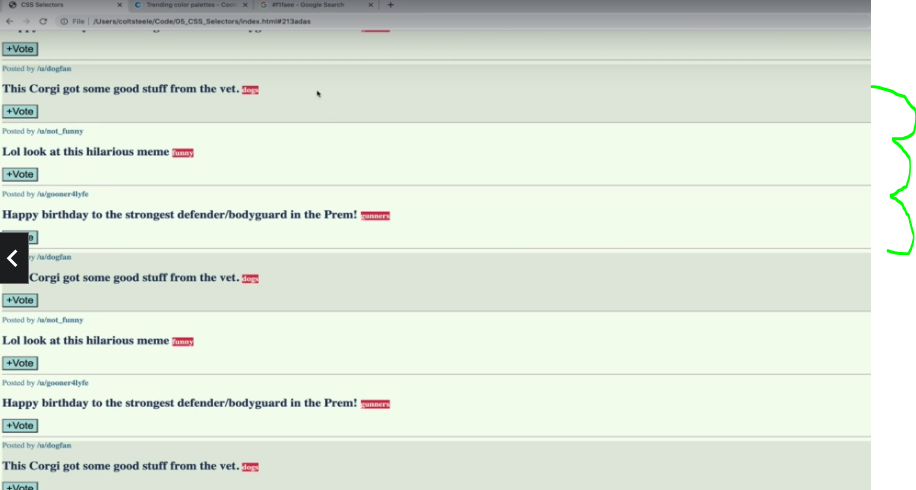

- First third gets selected, whitout `n`

```

.post:nth-of-type(3){
    backgroud-color: white;
}

```

- Only third gets selected 

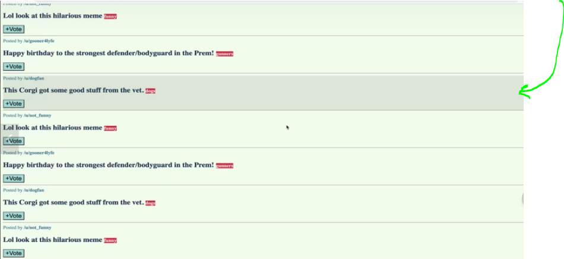

- **Pseudo elements**, modifiers to selectors `::` is used to indicate this one, but most browsers don't care `:` could also work
    - Pseudo elements are things which we are selecting
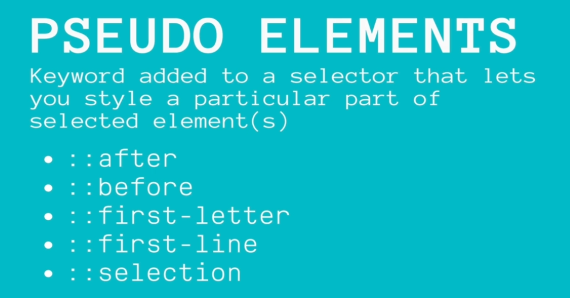

- [PseudoElements](https://developer.mozilla.org/en-US/docs/Web/CSS/Pseudo-elements)

- Example `first-letter` pseudo eloment

```

h2::first-letter {
    font-size 50px;
}

```

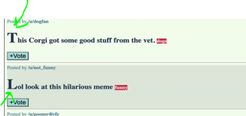


- todo katso oleelliset tehtävät listaan