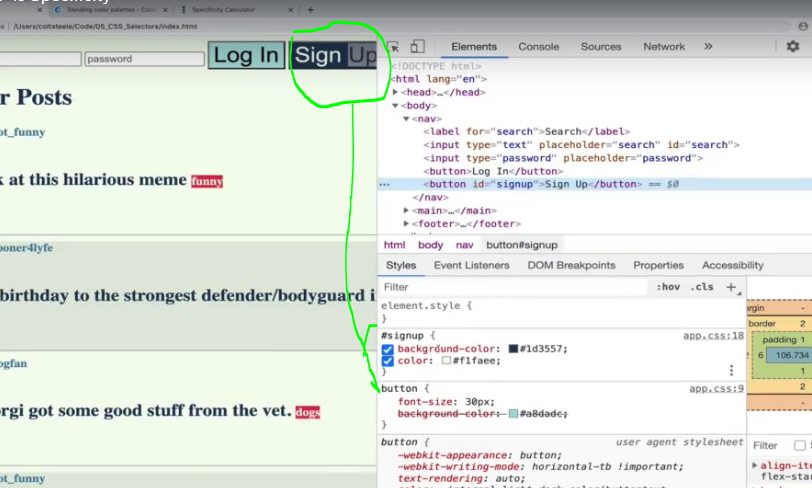

## Section 7: The World of CSS Selectos

# What I Learned

- There is many different selectors


- **Universal Selector**, selects all
    - Not very common
```
* {
    color: black;
}
```

- **Element Selector**, selects all spesifed img elements
    - Very common
```
img {
    widyh: 100px;
    height: 200px;
}
```


- **Selector list**, selects both h1 and h2, seperated by comma


- **ID selector**

- Id usefull to spesify unique element
    - Id selectors should keep minumum as possible, there is better selectors, but these are good nonetheless


- You can me your own color palette

- [Color palettes](https://coolors.co/palettes/trending)

- **Class Selector**


- Class selector uses `.`
    - Affects elemts with class tag
    
```
.complete {
    color: white;
}
```

- **Descendant Selector**


- Uses space between
- Selects all `<a>` nested inside `<li>` 

```
span a {
    color: red;
}
```


- Descendant selectors looks below first level untill it reaches point or the end. In this case finds `<a>` which is not clearly at first descendant
 
```

footer a {
    color: red;
}

```


- Selects all `<p>` which comes after `<h1>`
    - Need to be in same level

- In HTML

```
<input type="text" placeholder="search" id="search">
<button>Log In</button>
```

```
input + button {
    background-color: pink;
}
```


- Adjacent Selector would work like such


- We use `>`, li:s which are direct childs of div, will be selected 

```
footer > a {
    color: #457b9d;
}
```

- Below Direct Child in action
    - Looks element `<a>` which has to be direct child of `<footer>`


1. Only last `<a>` should get affected.


- As you can see last **2.** `<a>`, will get affected not `<a>` in **s1.**


- Selects based on attribute 

```

input[type="password"] {
    color: green;
}

```

- Example using Attribute Selector Following element would be selected and made to green


- [Attribute selectors](https://developer.mozilla.org/en-US/docs/Web/CSS/Attribute_selectors)

- `input[type="password"] ` common usage of AttributeSelctor


- **pseudo-class** Gives extra modifiers to selected element with selectors
    - They start with `:`
    - Some examples below
    - They are states

- `:hover` when element is hovered over
    - Hover is very common

```

button:hover {
    background-color: red;
}

```

- `:active` when element active, cliked example

- In chrome DevTools you can inspect these states and force them on given element


- [Pseudo-classes](https://developer.mozilla.org/en-US/docs/Web/CSS/Pseudo-classes)


- `:end-of-type` helps select nth element, example every third one


```

.post:nth-of-type(3n){
    backgroud-color: white;
}

```

- Every third gets selelected


- First third gets selected, whitout `n`

```

.post:nth-of-type(3){
    backgroud-color: white;
}

```

- Only third gets selected 


- **Pseudo elements**, modifiers to selectors `::` is used to indicate this one, but most browsers don't care `:` could also work
    - Pseudo elements are things which we are selecting


- [PseudoElements](https://developer.mozilla.org/en-US/docs/Web/CSS/Pseudo-elements)

- Example `first-letter` pseudo eloment

```

h2::first-letter {
    font-size 50px;
}

```


- Order where css is defined matters


- First h1 is red, then it will be purple
    - Up to down

- **Specificity** tells which selectors get applied to element in the end
    - Conflict more than one style is 
    trying to apply to given element


- Thumb rule which wins is illustrated below


- There is formula for **spesificity**, no need to remember this

- [Specifity Calculator](https://specificity.keegan.st/)

- We can inspect which css is being applied to given element, in order to troubles shoot specificity problems



- Id selector is very spesific, therefore its applied

- Chrome Dev Tools shows which are losing specificity batlle by crossing over


- Chrome Dev Tools showing which is losing specificity battle of background color


- You can also force states into buttons for example to see why some hover css is not working


- Inline Styles are more specific than any other what we been talking
    - Generally try not use **Inline Style**

- Example using inline style
    - If direct id would be used **Inline Style** would override this one 


- `!important` should not used if not nesseceray
    - Overrides specificity of css
    - Some cases use **!important** is to override 3rd party styles from some external library if needed for example.

```
button {
    background-color: magenta !important; 
}
```
 
**Inheritance**

- Such css would make whole body and its children **red**, if we haven't explicitly defined its childrens so

```

body {
    color: red;
}

```


- We can inspect inheritance from ChromeDevTools as such


 

```

form {
    color: greenyellow;
}

```


 
- We can fix this putting property `inherit`

```
button, input {
    color: inherit;
}
```


- Now it inherits color from what color is defined as most parent

 - Some elements are not inheritable, you need check documentations for this. Example `border`
    - Example documentation [Border](https://developer.mozilla.org/en-US/docs/Web/CSS/border)
    - Border would be **not** intheritable     


