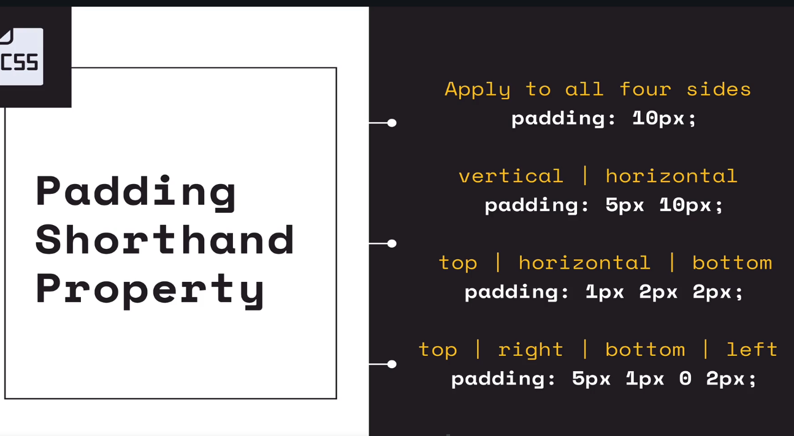
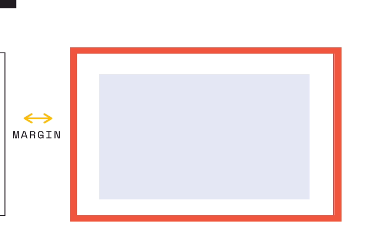
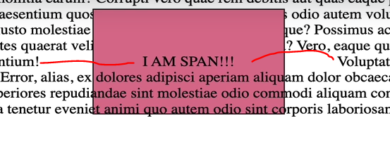

## Section 8: The CSS Box Model

# What I Learned

- Box model, means in css everything is box 
    - Even things which don't look like box are box, ie twitter icon


- Content box is elemnt itself


- Need to understand every of them to understand The Box Model

- **Width** and **Height**


- **Width** and **Height** controlls innercontent area


- Blue are is content box
- Setting width for content box

```

div {
    width: 200px;
}

```


- Content box is width 200px now


- Border around element

- Most important ones border properties to understand are following


- Pixels are pretty common unit for defining border

```

#one {
    background-color: red;
    border-width: 5px;
    border-color: black;
    border-style: solid;
}

```
- We need all these three to show border


- `box-sizing: border-box` makes element and border take pixels what it is was defined at beginning, in this case ``width: 200px``

- **Border** property is just shorthand shortcut to set border stuff show before
    - This is pattern where one propert set many others
        - This is common in css propertyes
- [Border](https://developer.mozilla.org/en-US/docs/Web/CSS/border)


```

#three {
    border-width: 4px;
    border-color: black;
    border-style: solid;
}

```

- Changes to with shortcut pattern to  such

```

#three{
    border: 4px solid black;
}

```
- This is more pattern to set css propertyes

- `border-radius` is to controll corners
    - [Border Radius](https://developer.mozilla.org/en-US/docs/Web/CSS/border-radius) 
    - People using this to make different shapes in css


- Padding is space between **border** and **content** itself

- 4 Induvidual Propertyes

```
padding-left
padding-right
padding-bottom
padding-top
```

- Shorthand Property `padding`

- [Padding](https://developer.mozilla.org/en-US/docs/Web/CSS/padding)


- **Blue** is the content
- **Green** is the padding itself

- Padding is pretty common to take it more space



- There is more **than one** way to set padding




- Margin is the space outside of border 

```
margin-left
margin-right
margin-bottom
margin-top
```

- Shorthand Property `padding`


- In developer tools you can see **margin** as such, color **orange**


- Display property

- Lot of propertyes in inline are not supported, we focus will focus three of them


- [Display](https://developer.mozilla.org/en-US/docs/Web/CSS/display)


- As we can see `h1` are block level elements 
and `span` are inline level elements

c

- We can set `h1` as inline level elements and `span` as block level element

```

h1 {
    display: inline;
}

span {
    display: block;
}

```


- **Inline elements** dont get affected by `width` and `height`
    - `padding` is not respected by other elements when inline element
        - Will not push elements away



- As you can see margin is respected is horizontal axis not vertical

- **block level** elements behaves litle bit diferently, following propertyes are respected 
    - `width`
    - `height`
    - `margin`
    - `padding`

- With block level these propertyes gets respected as exmple below


- Block level element to behave like inline element you can use `display: inline-block;`


- Trick with display to hide elemnt is to use `display:none`


- Following css would make such, takes half of parent

```
section {
    width: 800px;
    height: 800px;
}

div {
    width: 50%;
    height: 50%;
}
```


- Precentage are relatinve units

- Percentage **behaves differently** depending on element 
    - Example. `line-height`
        - Has nothing to do with parent element `line-height`, takes `%` of the `font-size`

```

font-size 40px;
border 1px solid black;
line-height: 200%;

```


- `1em` is same as its parent element in case of `font-size` 


- In case `h2`  `font-size: 2em`would get **60px** as font size

- `em` is common used in `padding` and `margin`
    - `1em` in these are litle **bit different**, its `1em` of font-size element itself

```

h2 {
    font-size: 5m; // Em refers in font-size of parent 
    margin-left: 1em; //Em in margin refers to font-size of the element
}

```


- If we want to grow button by ratios we need to use `em`
    - Pixels won't work


- We can make adjusting button with following css

```
button {
    font-size: 1em;
    padding: 0 1em;
    border-radius 0.5em;
    background-color: green;
    color: white;
}
```


