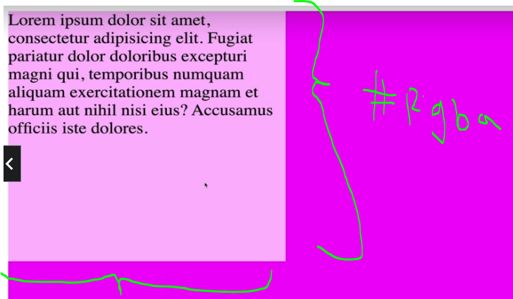
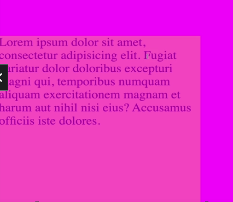
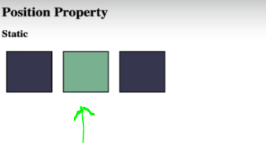
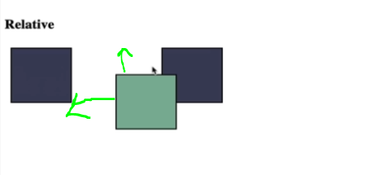

## Section 9: Other Assorted Useful CSS Properties

# What I Learned

- Alpha channel range from ` 1 to 0 `
    - See throught for color
    - `rgba(0, 209, 112, 0.5)`

```
#rgba {
    width: 50%;
    height: 50%;
    background-color rgba(255,255,255,0.7); // Only background color get affected
}
```



- As you can see only `background-color` get affected,text itself is not

- Opacity is **property** which you give for element
    - Affect all elements inside given element, unlike **Alpha channel**

```
#opacity{
    width: 50%;
    height: 50%;
    background-color: yellow;
    opacity: 0.3; //Opacity is property
}
```

- [Opacity](https://developer.mozilla.org/en-US/docs/Web/CSS/opacity)



- Opacity affects **whole** element

- **Postion** tells  how `top`, `right`, `bottom`, `left` propertyes dictates

- [Position](https://developer.mozilla.org/en-US/docs/Web/CSS/position)


- Static is default `position: static;`

- Example, `top`,`right`,`bottom`,`left` are not affected is **static** is in place

```
#static #middle {
    postion: static;
    top: 100px;
}
```



- Middle one is static one

- `position:relative` set position relative where it would be, gets affected by `top`,`right`,`bottom`,`left`

```
#relative #middle {
    postion: relative;
    top: 50px;
    left: 50px;
}
```
- Following would push element down from **top: 50px** and push from **left:50px**




- Element moves down and right 


- `position:absolute` element is removed from normal document flow


```
#absolute #middle {
    postion: absolute;
    top: 50px;
    left: 50px;
}
```