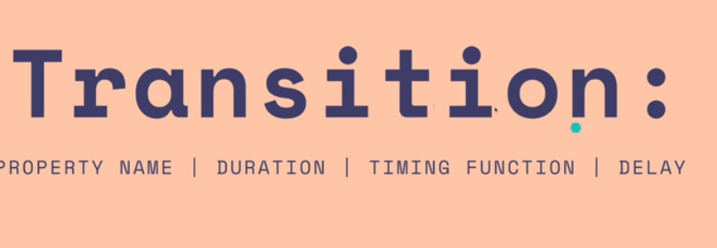
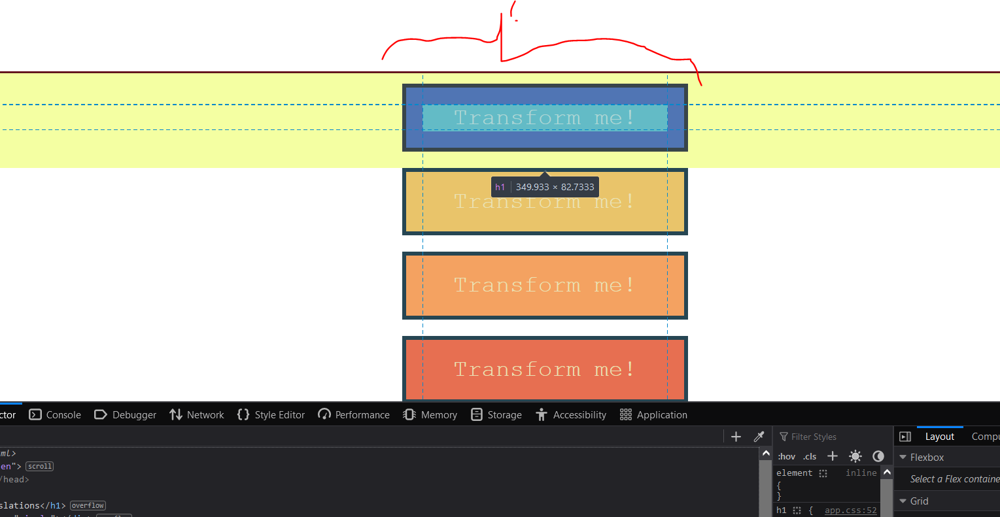
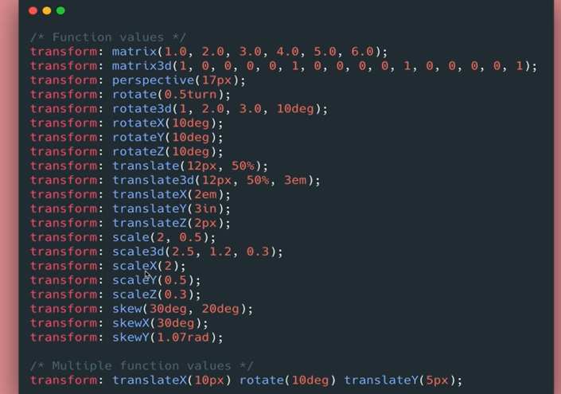
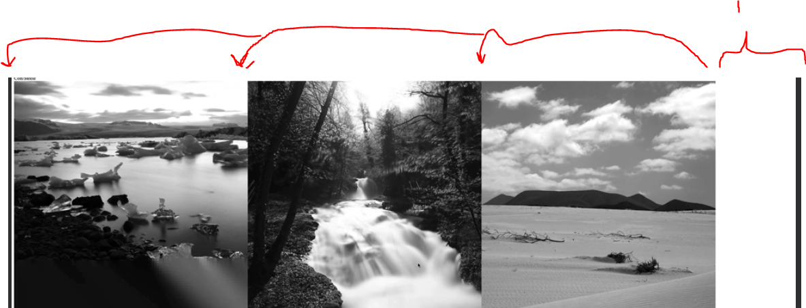

## Section 9: Other Assorted Useful CSS Properties

# What I Learned

- Alpha channel range from ` 1 to 0 `
    - See thought for color
    - `rgba(0, 209, 112, 0.5)`

```
#rgba {
    width: 50%;
    height: 50%;
    background-color rgba(255,255,255,0.7); // Only background color get affected
}
```


- As you can see only `background-color` get affected, text itself is not

- Opacity is **property** which you give for element
    - Affect all elements inside given element, unlike **Alpha channel**

```
#opacity{
    width: 50%;
    height: 50%;
    background-color: yellow;
    opacity: 0.3; //Opacity is property
}
```

- [Opacity](https://developer.mozilla.org/en-US/docs/Web/CSS/opacity)


- Opacity affects **whole** element

- **Position** tells how `top`, `right`, `bottom`, `left` properties dictates

- [Position](https://developer.mozilla.org/en-US/docs/Web/CSS/position)


- Static is default `position: static;`

- Example, `top`,`right`,`bottom`,`left` are not affected is **static** is in place

```
#static #middle {
    postion: static;
    top: 100px;
}
```


- Middle one is static one, **nothing changes**
    - For example ` top: 100px ` has no effect if element is **static**

- `position:relative` set position relative where it would be, gets affected by `top`,`right`,`bottom`,`left`

```
#relative #middle {
    postion: relative;
    top: 50px;
    left: 50px;
}
```

- Following would push element down from **top: 50px** and push from **left:50px**


- Element moves down and right 


- `position:absolute` element is removed from normal document flow


```
#absolute #middle {
    postion: absolute;
}
```


- 1. With **Absolute** element is hidden behind the middle element 
    - Removes completely from document flow
```
#absolute #middle {
    postion: absolute;
    top: 50px;
    left: 50px;
}
```


- It is positioned relative to its closest positioned ancestor, it is placed initial containing block
    - Basically means `<body>`
    - Positioned means, if element is anything other than **static** 

- If in other hand we position parent element as `relative`, `absolute` behaves little differently

```
#absolute {
    position : relative; 
}
```

```
#absolute #middle {
    position: absolute;
    top: 1px;
    left: 1px;
}

```


- As long parent element is positioned, `absolute` behaves relative to parent

- Last one will be `fixed`

```
#fixed #middle {
    postion: fixed;
    top: 0;
    left: 0;
}
```


1. It will go all way to of element, it will stay there, and It's removed from document flow


- You could make navigation bar using fixed values to stay on top


2. Fixed to top, from initial containing block


### Transitions

- We can apply different operations to elements



Style.css
```

.circle {
    width:  300px;
    height:  300px;
    background-color: magenta;
    transition: 3s;
}

.circle:hover {
    background-color: cyan;
    border-radius: 50%;
}

```

- [Easing function](https://easings.net/)

- Easing functions in action

```
div:nth-of-type(1){
    transition-timing-function: ease-in;
}
div:nth-of-type(2){
    transition-timing-function: ease-out;
}
div:nth-of-type(3){
    transition-timing-function: cubic-bezier(0.7, 0, 0.84, 0);;
}
div:nth-of-type(4){
    transition-timing-function: cubic-bezier(0.83, 0, 0.17, 1);
}
```
- Different timing function [Transition Timing Function](https://developer.mozilla.org/en-US/docs/Web/CSS/transition-timing-function)

- When making transition, we should be specific about our CSS transition. Not just `transition: all;`

### Transforms
 
- We can apply different operations to elements

- If element is **block level element**, we can center it to using its left and right **margin** by setting **auto** `margin: 20px auto;`



1. Margin left, and margin right settled to **auto** in action for **block level action**

- We can **Scale** our element [Scale](https://developer.mozilla.org/en-US/docs/Web/CSS/transform-function/scale)

- [Transform](https://developer.mozilla.org/en-US/docs/Web/CSS/transform-origin)

- [Skew](https://developer.mozilla.org/en-US/docs/Web/CSS/transform-function/skew)

- Here is some basics transforms
    - When needed, need to remind of this!



### Background

- Background image has many other properties. Some popular and useful properties

## Background-image

- [background-image](https://developer.mozilla.org/en-US/docs/Web/CSS/background-image)

## Background-size 

- [background-size](https://developer.mozilla.org/en-US/docs/Web/CSS/background-size)

## Background-repeat

- [background-repeat](https://developer.mozilla.org/en-US/docs/Web/CSS/background-repeat)

### Fonts

[Google Fonts](https://fonts.google.com/)

- If scale down UI, elements scale in same time. This means elements are not using fixed numbers like `200px`




1. Flexbox takes what is left in (1.) and distributes it between elements equally

- This type of CSS, where lots of math is included used to be very common!

```
img {
	
	width: 30%;  
	float: left; 
	/*float takes out flow of document. We got rid of white spacing which browser adder for uss*/
	/* 10/6= 1.66 */
	margin: 1.66%;
}	
```

- Nowadays, there is easier ways to do this. Example **Flex box**